# Xây dựng mô hình Deep Learning tối ưu cho nhận diện khuôn mặt trong hệ thống chấm công trong công ty

**Tác giả:** Đinh Nhật Ký\
**Email**: Ky.dn215410@sis.hust.edu.vn\
**Giảng viên hướng dẫn:** ThS. Lê Đức Trung\
**Ngành:** Khoa học máy tính \
**Khoa:** Khoa học máy tính \
**Trường:** Công nghệ Thông tin và Truyền thông, Đại học Bách Khoa Hà Nội


## Tóm tắt

Đồ án này tập trung vào việc xây dựng một **hệ thống chấm công tự động dựa trên nhận diện khuôn mặt** sử dụng các mô hình Deep Learning tiên tiến. Hệ thống giải quyết những hạn chế của phương pháp chấm công thủ công (tốn thời gian, dễ gian lận, khó theo giõi thời gian làm việc của nhân viên) và các hệ thống nhận diện khuôn mặt hiện tại (dễ bị tấn công giả mạo, tốc độ xử lý, thời gian thực, giới hạn về số lượng nhân viên, hạn chế về góc chụp, ánh sáng và chất lượng ảnh...).

Giải pháp được đề xuất bao gồm một **pipeline xử lý hoàn chỉnh** gồm tiền xử lý ảnh (phát hiện, căn chỉnh khuôn mặt, đánh giá chất lượng khuôn mặt), kiểm tra chống giả mạo, trích xuất đặc trưng bằng mô hình học sâu với mạng xương sống (backbone) được tùy chỉnh, và so khớp vector nhúng, chấm công và lưu thông tin lên cơ sở dữ liệu thời gian thực. Hệ thống được tối ưu hóa về hiệu năng xử lý, đạt tốc độ nhận diện nhanh, độ chính xác cao và có khả năng tùy chỉnh linh hoạt khi thay đổi các cấu hình hệ thống.

Đóng góp chính của đồ án là **huấn luyện mô hình trích xuất đặc trưng khuôn mặt với số lượng tham số nhỏ** sử dụng hàm loss được cải tiến (CDML) và xây dựng hoàn chỉnh hệ thống chấm công bằng nhận diện khuôn mặt chống giả mạo với sự kết hợp của nhiều mô hình học sâu nhằm nâng cao độ chính xác nhưng vẫn đảm bảo được tốc dộ xử lý để hệ thống có thể chạy thời gian thực không bị chậm, đạt hiệu suất cao, có tích hợp các thông tin chấm công cơ bản.

## Bài toán

Bài toán chấm công thủ công truyền thống gặp nhiều hạn chế như tốn thời gian, dễ gian lận, và khó kiểm soát số liệu, giới hạn về số lượng nhân viên, không điều chỉnh được các cấu hình hệ hống, chưa tích hợp realtime. Các hệ thống chấm công tự động bằng nhận diện khuôn mặt hiện có vẫn còn tiềm ẩn nguy cơ gian lận khi đối tượng có thể giả mạo khuôn mặt bằng ảnh hoặc video. Bên cạnh đó, các hệ thống này còn đối mặt với thách thức về độ chính xác trong điều kiện thực tế (ánh sáng yếu, thay đổi ngoại hình, góc độ), tốc độ xử lý và yêu cầu một pipeline tích hợp đầy đủ các bước.

## Giải pháp đề xuất

Đồ án đề xuất xây dựng hệ thống chấm công bằng nhận diện khuôn mặt ứng dụng Deep Learning với các đặc điểm chính:
*   Sử dụng phương pháp **học không gian nhúng (Embedding Learning)** để trích xuất đặc trưng khuôn mặt.
*   Dựa trên mô hình **ArcFace** - một phương pháp state-of-the-art trên nhiều tập dữ liệu, đồng thời **điều chỉnh backbone và hàm loss** để tối ưu hóa độ chính xác và tốc độ.
*   Đề xuất hàm mất mát **Combined Dynamic Margin Loss (CDML)**, mở rộng từ ArcFace bằng cách áp dụng margin động dựa trên độ khó của từng mẫu, giúp tăng khả năng phân biệt giữa các lớp.
*   Sử dụng kiến trúc mạng xương sống **IResNet** và các biến thể **IResNet_Lite** (r18_lite, r50_lite, r100_lite) với số lượng tham số nhỏ, phù hợp cho triển khai trên thiết bị tài nguyên hạn chế.
*   Xây dựng **pipeline xử lý hoàn chỉnh** kết hợp sử dụng nhiều mô hình học sau, bao gồm thu nhận ảnh từ camera, phát hiện khuôn mặt(sử dụng MTCNN/BlazeFace),Đánh giá chất lượng khuôn mặt(sử dụng LightQNet),kiểm tra chống giả mạo(sử dụng FASNet/MiniFASNet), trích xuất đặc trưng và so khớp vector nhúng(Dùng model huấn luyện theo hàm loss đề xuất).
*   Tích hợp với cơ sở dữ liệu **Firebase Realtime Database** để quản lý thông tin nhân sự, lịch sử chấm công và cấu hình hệ thống.
*   Lưu trữ ảnh và vector đặc trưng trên **Cloudinary**.

### Minh họa các hàm mất mát và framework

#### Hàm mất mát ArcFace

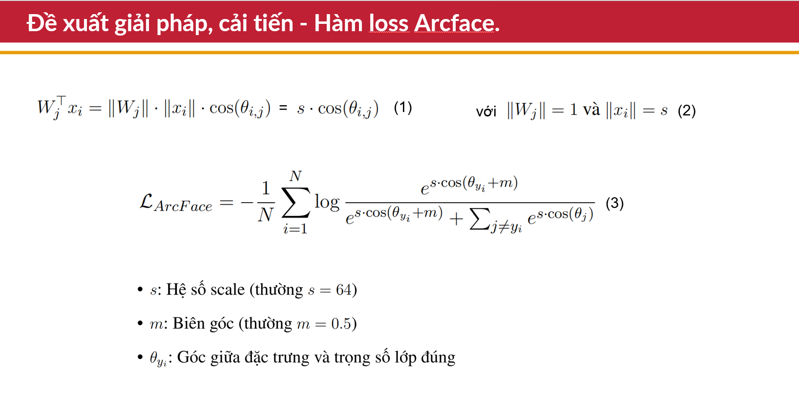

*Hàm mất mát ArcFace (Additive Angular Margin Loss) bổ sung một biên góc (angular margin) vào hàm softmax, giúp tăng khả năng phân biệt giữa các lớp bằng cách buộc các vector đặc trưng của cùng một lớp phải gần nhau hơn trên hypersphere, còn các lớp khác thì cách xa nhau một góc nhất định. Điều này giúp cải thiện đáng kể hiệu suất nhận diện khuôn mặt so với softmax truyền thống.*

#### Hàm mất mát Combined Dynamic Margin Loss (CDML)

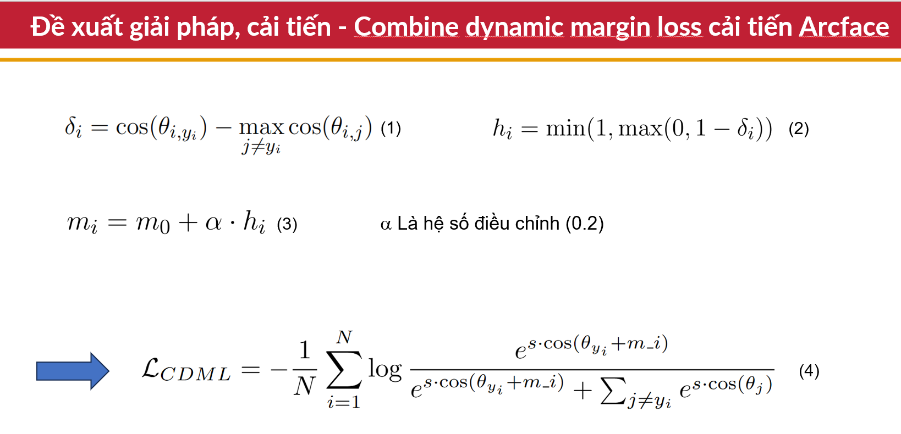

*Hàm mất mát CDML (Combined Dynamic Margin Loss) là cải tiến từ ArcFace, trong đó margin được điều chỉnh động dựa trên độ khó của từng mẫu (khoảng cách giữa mẫu dương và mẫu âm gần nhất). Điều này giúp mô hình học tốt hơn với các trường hợp khó, tăng khả năng tổng quát hóa và giảm lỗi nhận nhầm hoặc từ chối nhầm trong nhận diện khuôn mặt.*


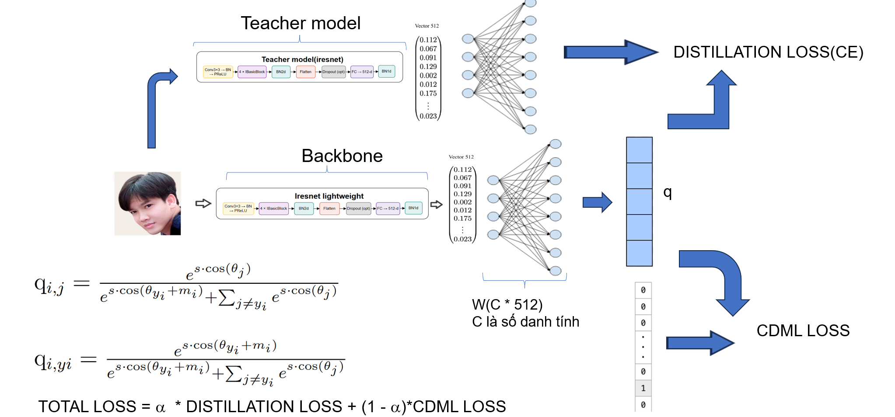

*Hình minh họa quá trình Knowledge Distillation, trong đó một mô hình lớn (teacher) truyền đạt tri thức cho một mô hình nhỏ hơn (student) thông qua việc tối ưu hóa không chỉ loss thông thường (như cross-entropy) mà còn loss giữa các phân phối đầu ra (soft targets) của teacher và student. Điều này giúp mô hình student học được các đặc trưng tổng quát hóa tốt hơn, đạt hiệu suất cao dù có ít tham số hơn, rất phù hợp cho các ứng dụng nhận diện khuôn mặt trên thiết bị tài nguyên hạn chế.*


## Kiến trúc hệ thống

Hệ thống được thiết kế theo mô hình pipeline xử lý các khung hình từ camera.


#### Framework distillation tổng thể


*Hình trên minh họa framework distillation hoặc pipeline tổng thể của hệ thống nhận diện khuôn mặt. Các thành phần chính bao gồm: thu nhận ảnh, phát hiện và căn chỉnh khuôn mặt, kiểm tra chống giả mạo, đánh giá chất lượng khuôn mặt, trích xuất đặc trưng, đối sánh và xác định danh tính, xác thực nhiều frame, và lưu trữ thông tin lên hệ thống dữ liệu. Việc kết hợp nhiều mô hình và kỹ thuật học sâu giúp hệ thống đạt hiệu suất cao, chống giả mạo và hoạt động ổn định trong thực tế.*

Các thành phần chính bao gồm:
1.  **Thu nhận ảnh đầu vào (Collect frame):** Lấy mẫu khung hình từ webcam, kiểm tra chất lượng (diện tích khuôn mặt, căn giữa). Sử dụng BlazeFace để phát hiện và căn chỉnh khuôn mặt nhanh trong giai đoạn này.
2.  **Kiểm tra chống giả mạo (Anti-spoofing):** Sử dụng mô hình FASNet/MiniFASNet để phát hiện khuôn mặt giả mạo (ảnh in, ảnh chụp, video, mặt nạ...).

3.  **Đánh giá chất lượng khuôn mặt(Face quality assessment):** Sử dụng LightQNet để đánh giá chất lượng ảnh khuôn mặt đánh giá về góc chụp, ảnh sáng, độ lớn, góc nghiêng, độ mờ từ đó lọc ra các hình ảnh khuôn mặt đạt tiêu chuẩn.

4.  **Phát hiện và chuẩn hóa khuôn mặt(Face detection and standardization):** Sử dụng MTCNN để phát hiện chính xác vùng khuôn mặt và các điểm đặc trưng (landmarks), sau đó chuẩn hóa và resize kích thước ảnh về (112, 112).

5.  **Trích xuất đặc trưng (Embedding):** Đưa ảnh khuôn mặt đã chuẩn hóa qua mô hình được huấn luyện (IResNet_Lite + CDML) để thu được vector đặc trưng 512 chiều.
6.  **Đối sánh và xác định danh tính (Identification):** So sánh vector đặc trưng truy vấn với cơ sở dữ liệu vector đã lưu trữ bằng độ đo Cosine similarity hoặc Euclidean distance. Xác định danh tính dựa trên khoảng cách trung bình nhỏ nhất tới các vector trong từng lớp.
7.  **Kiểm tra xác thực từng frame (Check validation):** Tổng hợp kết quả từ nhiều frame hợp lệ để đưa ra quyết định cuối cùng về danh tính, sử dụng ngưỡng xác nhận.
8.  **Lưu trữ và tích hợp hệ thống:** Lưu trữ vector embedding và ảnh đại diện trên Cloudinary, thông tin nhân sự và lịch sử chấm công trên Firebase Realtime Database.

## Kết quả thực nghiệm

Phần này trình bày các kết quả đánh giá mô hình trích xuất đặc trưng và hiệu suất tổng thể của hệ thống.

### So sánh hiệu năng giữa các hàm mất mát

Đồ án so sánh hàm mất mát CDML với các hàm mất mát khác (ArcFace, CosFace, Softmax, v.v.) khi huấn luyện mô hình với mạng xương sống **ResNet50** trên tập dữ liệu **CASIA-WebFace**.

**Bảng Độ chính xác (%) trên các tập xác thực của các hàm mất mát khác nhau**

| Loss Functions              | LFW   | CFP-FP | AgeDB |
| :-------------------------- | :---- | :----- | :---- |
| CDML (0.49)(Our)            | 99.58 | 93.86  | 96.62 |
| ArcFace (0.4)               | 99.53 | 95.41  | 94.98 |
| ArcFace (0.45)              | 99.46 | 95.47  | 94.93 |
| ArcFace (0.5)               | 99.53 | 95.56  | 95.15 |
| ArcFace (0.55)              | 99.41 | 95.32  | 95.05 |
| SphereFace                  | 99.42 | –      | –     |
| SphereFace (1.35)           | 99.11 | 94.38  | 91.70 |
| CosFace                     | 99.33 | –      | –     |
| CosFace (0.35)              | 99.51 | 95.44  | 94.56 |
| CM1 (1, 0.3, 0.2)           | 99.48 | 95.12  | 94.38 |
| CM2 (0.9, 0.4, 0.15)        | 99.50 | 95.24  | 94.86 |
| Softmax                     | 99.08 | 94.39  | 92.33 |
| Norm-Softmax (s = 64)       | 98.56 | 89.79  | 88.72 |
| Norm-Softmax (s = 20)       | 99.20 | 94.61  | 92.65 |
| Norm-Softmax + Intra        | 99.30 | 94.85  | 93.58 |
| Norm-Softmax + Inter        | 99.22 | 94.73  | 92.94 |
| Norm-Softmax + Intra + Inter| 99.31 | 94.88  | 93.76 |
| Triplet (0.35)              | 98.98 | 91.90  | 89.98 |
| ArcFace + Intra             | 99.45 | 95.37  | 94.73 |
| ArcFace + Inter             | 99.43 | 95.25  | 94.55 |
| ArcFace + Intra + Inter     | 99.43 | 95.42  | 95.10 |
| ArcFace + Triplet           | 99.50 | 95.51  | 94.40 |

Kết quả cho thấy **CDML đạt độ chính xác khá cao** trên LFW (99.58%) và AgeDB (96.62%), tương đương hoặc cao hơn một số phương pháp hiện có như ArcFace và CosFace.

### Đánh giá với các Backbone nhẹ trên CASIA-WebFace

Đánh giá so sánh hàm mất mát CDML và ArcFace trên các backbone nhẹ hơn là **r18_lite** và **r50_lite**, huấn luyện trên **CASIA-WebFace**.

**Bảng So sánh độ chính xác (%) của các mô hình trên các tập kiểm thử, với bộ dữ liệu huấn luyện là CASIA-WEBFACE(các kết quả huấn luyện với cùng các siêu tham số chỉ thay đổi hàm loss)**

| Dataset | r18_lite        |           | r50_lite        |           |
| :------ | :-------------- | :-------- | :-------------- | :-------- |
|         | ArcFace         | CDML      | ArcFace         | CDML      |
| LFW     | 99.08 ± 0.46    | 98.92 ± 0.51 | 98.88 ± 0.57    | 99.17 ± 0.39 |
| CFP-FP  | 91.24 ± 1.31    | 92.34 ± 1.21 | 92.57 ± 1.39    | 94.14 ± 1.29 |
| CFP-FF  | 99.14 ± 0.28    | 99.10 ± 0.35 | 99.06 ± 0.50    | 99.31 ± 0.50 |
| CALFW   | 92.63 ± 1.15    | 92.27 ± 1.42 | 91.77 ± 1.00    | 92.78 ± 1.12 |
| CPLFW   | 85.13 ± 1.78    | 85.48 ± 2.49 | 86.57 ± 2.04    | 88.08 ± 1.89 |
| AgeDB   | 92.12 ± 1.19    | 92.22 ± 2.09 | 90.88 ± 2.10    | 93.85 ± 1.26 |

Khi sử dụng backbone **r50_lite**, CDML cho hiệu quả nổi bật hơn ArcFace trên tất cả các tập kiểm thử. Trên r18_lite, CDML cho kết quả tương đương hoặc nhỉnh hơn nhẹ so với ArcFace. CDML thể hiện tiềm năng vượt trội về độ chính xác khi kết hợp với các backbone mạnh hơn.


### Đánh giá mô hình huấn luyện trên MS1MV3

Để đánh giá hiệu quả của CDML so với các phương pháp tiên tiến khác, đồ án so sánh với các phương pháp đã được công bố trên các tập validation chuẩn.

**Bảng Độ chính xác (%) trên các tập validation CFP-FP, LFW, AgeDB, CALFW và CPLFW**

| Method | CFP-FP | CPLFW | AgeDB | CALFW | LFW |
| :----- | :----- | :---- | :---- | :---- | :--- |
| Center Loss | - | 77.48 | - | 85.48 | 99.28 |
| SphereFace | - | 81.40 | - | 90.30 | 99.42 |
| VGGFace2 | - | 84.00 | - | - | 98.95 |
| MV-Softmax | 98.28 | 92.83 | 97.95 | **96.10** | - |
| Search-Softmax | 95.64 | 89.00 | 97.75 | 95.40 | - |
| FaceGraph | 96.90 | 92.27 | 97.99 | 95.67 | - |
| CurricularFace | 98.36 | 93.13 | 98.37 | 96.05 | - |
| MS1MV3, R100, ArcFace | 98.79 | 93.21 | 98.23 | 96.02 | 99.83 |
| IBUG500K, R100, ArcFace | 98.87 | 93.43 | **98.38** | **96.10** | 99.83 |
| MS1MV3, R100, CDML(Our) | **98.94** | **94.08** | 97.75 | 96.05 | **99.85** |
| MS1MV3, R_lightweight, CDML+DL(Our) | 97.98 | 92.48 | 97.03 | 95.55 | 99.76 |

Kết quả cho thấy **CDML đạt hiệu suất vượt trội** trên nhiều tập validation quan trọng:
- **CFP-FP**: CDML đạt 98.94%, cao nhất trong tất cả các phương pháp
- **CPLFW**: CDML đạt 94.08%, vượt trội so với các phương pháp khác
- **LFW**: CDML đạt 99.85%, cao nhất trong bảng so sánh
- **CALFW**: CDML đạt 96.05%, tương đương với các phương pháp tốt nhất
- **AgeDB**: CDML đạt 97.75%, chỉ thấp hơn một chút so với IBUG500K, R100, ArcFace

Điều này chứng tỏ **CDML có khả năng tổng quát hóa mạnh mẽ** và hiệu quả trên nhiều loại dữ liệu khác nhau, đặc biệt là trong các điều kiện thách thức như góc chụp khác nhau (CFP-FP) và thay đổi về độ tuổi (AgeDB).


Đồ án huấn luyện các mô hình r50_lite và r100_lite trên tập dữ liệu lớn hơn là **MS1MV3** để tăng độ chính xác.

**Bảng So sánh độ chính xác (%) của các mô hình r50_lite và r100_lite trên các tập kiểm thử, với bộ dữ liệu huấn luyện là MS1MV3**

| Dataset   | r50_lite     | r100_lite    |
| :-------- | :----------- | :----------- |
| LFW       | 99.47 ± 0.37 | 99.67 ± 0.27 |
| CFP-FP    | 92.87 ± 1.41 | 92.83 ± 1.92 |
| CFP-FF    | 99.57 ± 0.34 | 99.63 ± 0.31 |
| CALFW     | 95.32 ± 1.02 | 95.10 ± 1.27 |
| CPLFW     | 88.83 ± 1.63 | 89.08 ± 1.85 |
| AgeDB-30  | 96.35 ± 0.94 | 95.95 ± 0.91 |

Cả hai mô hình r50_lite và r100_lite đều đạt **độ chính xác khá cao** trên hầu hết các tập kiểm thử, chứng tỏ khả năng nhận diện mạnh mẽ khi huấn luyện trên MS1MV3.

Đánh giá trên các tập chuẩn **IJB-B** và **IJB-C** cho tác vụ verification (độ chính xác 1:1).

**Bảng 1:1 Độ chính xác (TPR@FPR=1e-4) trên dataset IJB-B và IJB-C với task verification**

| Method                | IJB-B (%) | IJB-C (%) |
| :-------------------- | :-------- | :-------- |
| ResNet50              | 78.4      | 82.5      |
| SENet50               | 80.0      | 84.0      |
| MN-vc                 | 83.1      | 86.2      |
| DCN                   | 84.9      | 88.5      |
| Crystal Loss          | -         | 92.29     |
| AIM                   | -         | 89.5      |
| P2SGrad               | -         | 92.25     |
| Adocos                | -         | 92.4      |
| PFE                   | -         | 93.3      |
| MV-Softmax            | 93.6      | 95.2      |
| AFRN                  | 88.5      | 93.1      |
| PFE                   | -         | 93.25     |
| DUL                   | -         | 94.61     |
| URFace                | -         | 96.6      |
| CircleLoss            | -         | 93.95     |
| CurricularFace        | 94.86     | 96.15     |
| GroupFace             | 94.93     | 96.26     |
| BroadFace             | 94.61     | 96.03     |
| VGG2, R50, ArcFace    | 89.8      | 92.79     |
| MS1MV3, R100, ArcFace | 95.42     | 96.83     |
| IBUG-500K, R100, ArcFace | 96.02  | 97.27     |
| MS1MV3, r100_lite, CDML(Ours)| **91.15** | **93.13** |
| MS1MV3, r50_lite, CDML(Ours) | **90.83** | **93.15** |

**Bảng TPR ở nhiều mức FPRs trên tập IJB-B và IJB-C for r100_lite and r50_lite**

| Model       | Dataset | 1e-6  | 1e-5  | 1e-4  | 0.001 | 0.01  | 0.1   |
| :---------- | :------ | :---- | :---- | :---- | :---- | :---- | :---- |
| r100_lite   | IJB-B   | 36.85 | 83.57 | 91.15 | 94.30 | 96.87 | 98.33 |
|             | IJB-C   | 83.06 | 89.50 | 93.13 | 95.56 | 97.59 | 98.82 |
| r50_lite    | IJB-B   | 36.11 | 83.61 | 90.83 | 94.35 | 96.81 | 98.49 |
|             | IJB-C   | 83.78 | 89.42 | 93.15 | 95.64 | 97.65 | 98.88 |

Các mô hình **r100_lite và r50_lite đạt hiệu suất tương đối tốt** trên IJB-B và IJB-C, với TPR@FPR=1e-4 lần lượt là 91.15% và 90.83% trên IJB-B, và 93.13% và 93.15% trên IJB-C. Hiệu suất này thấp hơn so với các phương pháp tiên tiến nhất (như IBUG-500K, R100, ArcFace đạt 96.02% trên IJB-B và 97.27% trên IJB-C), nhưng vẫn chứng tỏ tính hiệu quả của các mô hình nhẹ trong bối cảnh tài nguyên hạn chế.

### Đánh giá tốc độ suy luận và bộ nhớ mô hình

So sánh các thông số về số lượng tham số, kích thước mô hình, thời gian suy luận trên CPU và GFLOPs giữa các dòng Resnet và Resnet-lite.

**Bảng So sánh thông số mô hình dựa trên số lượng tham số, kích thước mô hình, thời gian suy luận (CPU), và GFLOPs đo trên thiết bị CPU (16G Ram)** với input_size (112,112)

| Mô hình     | Số tham số   | Kích thước (MB) | Thời gian suy luận (ms/image) | GFLOPs |
| :---------- | :----------- | :-------------- | :---------------------------- | :----- |
| R18         | 24,025,600   | 91.65           | 46.40                         | 2.63   |
| R34         | 34,139,328   | 130.20          | 74.92                         | 4.48   |
| R50         | 43,590,848   | 166.28          | 108.02                        | 6.33   |
| R100        | 65,156,160   | 248.55          | 194.91                        | 12.13  |
| **R18_lite**| **9,222,656**| **35.70**       | **16.82**                     | **0.67** |
| R34_lite    | 11,754,336   | 44.84           | 26.20                         | 1.13   |
| R50_lite    | 14,120,800   | 53.87           | 39.39                         | 1.60   |
| R100_lite   | 19,521,312   | 74.47           | 79.10                         | 3.05   |

### Bảng so sánh thông số các model

| Mô hình        | Số tham số   | Kích thước (MB) | Thời gian suy luận (ms/image) | GFLOPs |
|:-------------- |:------------:|:---------------:|:-----------------------------:|:------:|
| R18            | 24,025,600   | 91.65           | 46.40                         | 2.63   |
| R34            | 34,139,328   | 130.20          | 74.92                         | 4.48   |
| R50            | 43,590,848   | 166.28          | 108.02                        | 6.33   |
| R100           | 65,156,160   | 248.55          | 194.91                        | 12.13  |
| **R18_lite**   | 9,222,656    | 35.70           | 16.82                         | 0.67   |
| R34_lite       | 11,754,336   | 44.84           | 26.20                         | 1.13   |
| R50_lite       | 14,120,800   | 53.87           | 39.39                         | 1.60   |
| R100_lite      | 19,521,312   | 74.47           | 79.10                         | 3.05   |
| R_lightweight  | 5,086,432    | 19.43           | 8.71                          | 0.098  |

Thời gian suy luận của MTCNN và FasNet trên thiết bị CPU (16G Ram):

**Bảng Các thông số của mô hình MTCNN, LightQNet và FasNet (Thiết bị cpu Ram 16G)**

| Mô hình | Số tham số | Thời gian suy luận (ms/image) | Kích thước (MB) |
| :------ | :--------- | :---------------------------- | :-------------- |
| MTCNN   | 495,850    | 289.60                        | 446.21          |
| FasNet  | 868,146    | 35.93                         | 211.59          |
|LightQNet| 130,915    | 11.17                         | 444.84          |

Thời gian suy luận của LightQnet và FasNet cũng rất nhanh, giúp pipeline tổng thể không bị chậm đáng kể. Đối với MTCNN độ chính xác cao yêu cầu thời gian infer chậm hơn tuy nhiên có thể khắc phục bằng cách chạy song song với batchsize > 1

### Đánh giá tổng thể hệ thống nhận diện khuôn mặt

Hệ thống được đánh giá trên bộ dữ liệu tự thu thập (1131 danh tính, >18000 ảnh người nổi tiếng tại Việt Nam).

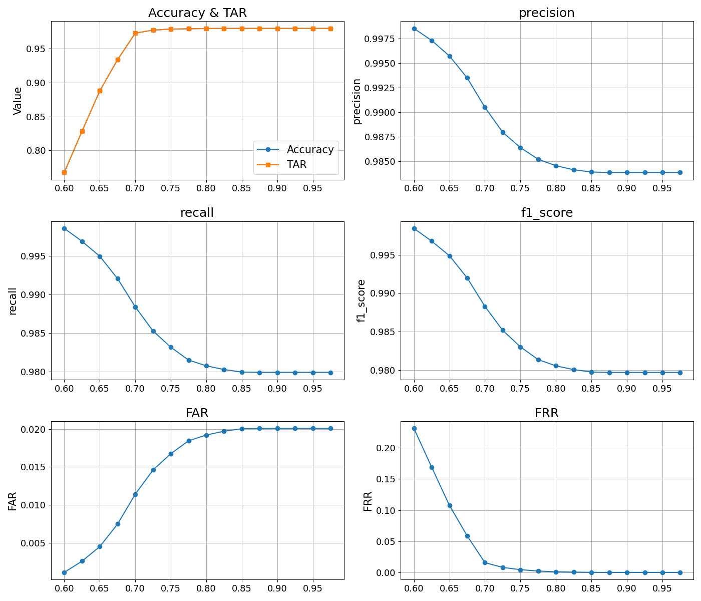

Hình trên minh họa sự biến thiên của các chỉ số đánh giá (TAR, FAR, FRR, Accuracy, Precision, Recall, F1-score) theo ngưỡng Cosine threshold.

*   **TAR** (True Accept Rate) và **Accuracy** tăng nhanh và đạt ngưỡng cực đại (gần 0.98) ở ngưỡng khoảng 0.70.
*   **FAR** (False Accept Rate) tăng khi ngưỡng tăng, cho thấy rủi ro nhận nhầm tăng lên vì khi đó hệ thống trở nên 'dễ dãi ' hơn trong việc chấp nhận các cặp vector có khoảng cách lớn.
*   **FRR** (False Reject Rate) giảm khi ngưỡng tăng, hệ thống ít từ chối sai các cá thể hợp lệ hơn.
*   **Precision** và **Recall** có xu hướng giảm dần khi ngưỡng tăng. Precision duy trì cao (>0.984), trong khi Recall giảm phản ánh sự đánh đổi.
*   **F1-score** giảm nhẹ nhưng vẫn ổn định trên 0.980.

Hệ thống đạt hiệu suất tối ưu khi **cosine threshold nằm trong khoảng từ 0.70 đến 0.85**, cân bằng tốt giữa việc chấp nhận đúng, hạn chế từ chối sai và kiểm soát rủi ro nhận nhầm. Phương pháp xác định ngưỡng tối ưu dựa trên khoảng cách trung bình giữa các cặp positive (cùng người) và negative (khác người) trên dữ liệu VN-Celeb cho kết quả ngưỡng Cosine là **0.705** (trung bình positive: 0.452, trung bình negative: 0.958).

### Phân tích các mẫu dự đoán sai

Hệ thống gặp phải hai loại lỗi phổ biến: từ chối nhầm (False Negative) và nhận nhầm người (False Positive).

**Bảng Các trường hợp từ chối nhầm với ngưỡng cosine 0.7**

| Ảnh thử | Ảnh nhãn | Khoảng cách | Ghi chú                                      |
| :------ | :------- | :---------- | :------------------------------------------- |
|      |       | 0.74        | Cùng người – khác góc chụp, ảnh mờ           |
|  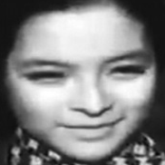    |       | 0.71        | Cùng người – khác màu sắc, góc chụp, ảnh đen trắng |
|      |       | 0.76        | Cùng người – khác nhau về độ tuổi, màu sắc    |
|      |       | 0.79        | Cùng người – biểu cảm khác                  |
|      |  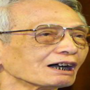     | 0.73        | Cùng người – ảnh mờ, màu khác, đeo kính       |

Nguyên nhân từ chối nhầm chủ yếu do **thay đổi lớn về góc chụp, biểu cảm, chất lượng ảnh, hoặc sự chênh lệch độ tuổi** khiến khoảng cách đặc trưng vượt quá ngưỡng.

**Bảng Các trường hợp nhận nhầm người với ngưỡng cosine 0.7**

| Cặp ảnh | Khoảng cách | Ghi chú                                      |
| :------ | :---------- | :------------------------------------------- |
| 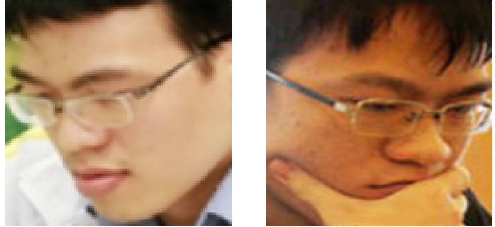   | 0.6242      | Khác người - góc nghiêng, đeo kính, biểu cảm tương tự |
|  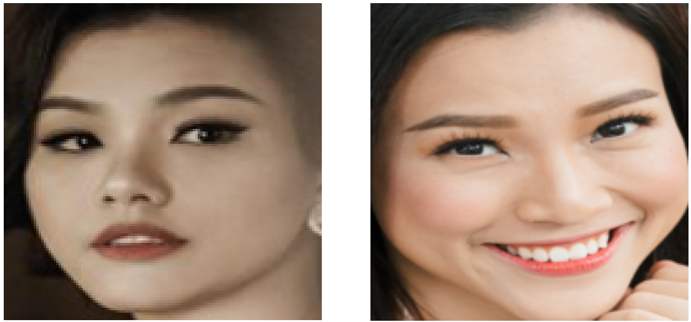   | 0.6207      | Khác người - khuôn mặt đối xứng, kiểu tóc và trang điểm tương đồng |
|  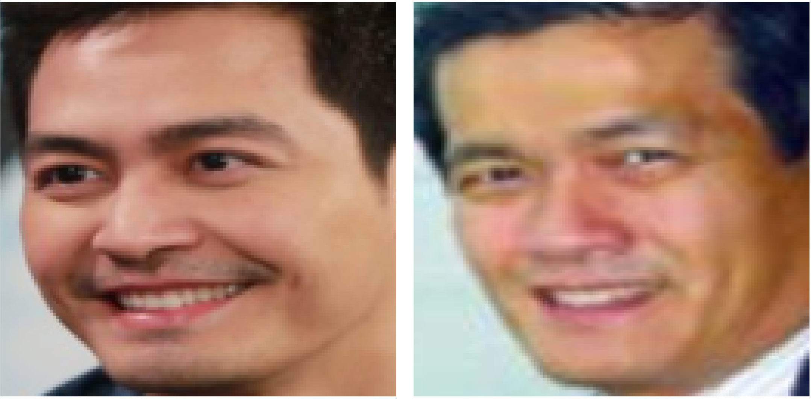    | 0.5609      | Khác người - khuôn mặt tròn, nụ cười và kiểu tóc tương tự |
|  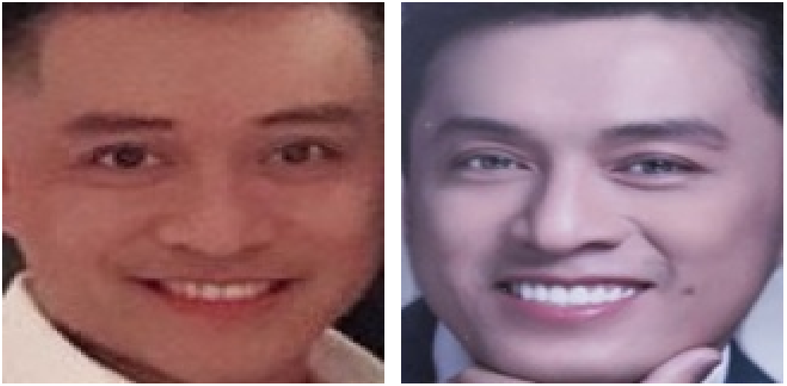    | 0.4995      | Khác người - ánh sáng và góc chụp tương đồng, biểu cảm gần giống |
|  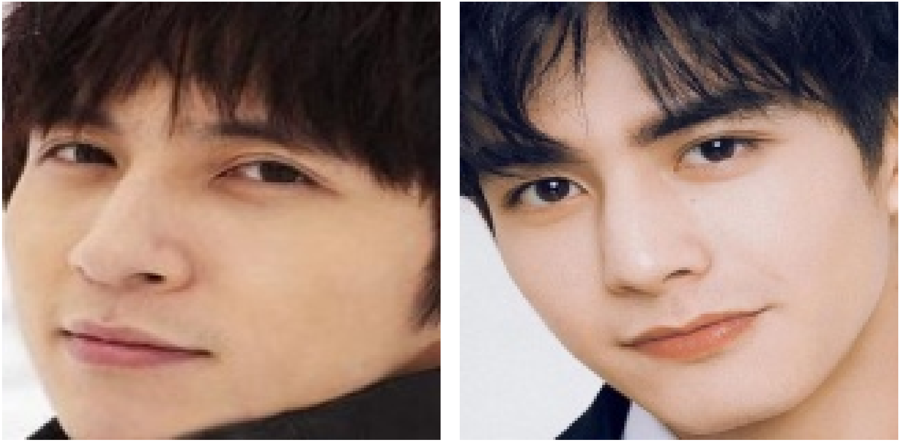    | 0.6630      | Khác người - kiểu tóc giống nhau, góc chụp thẳng, làn da sáng |
|  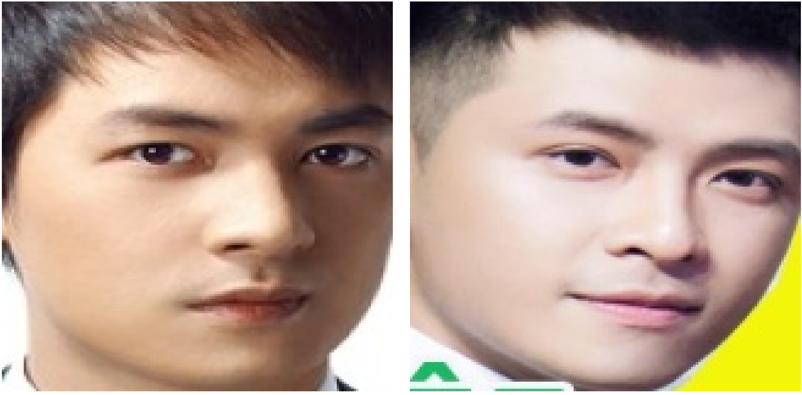    | 0.4925      | Khác người - mắt, môi và cấu trúc mặt tương đồng, nền ảnh tương phản thấp |
|  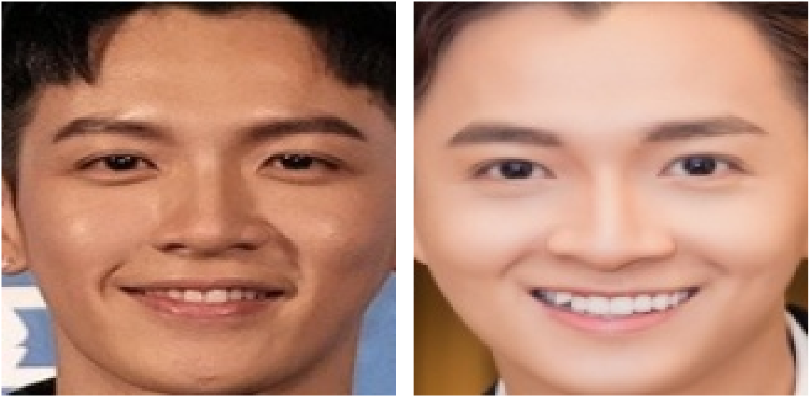    | 0.5065      | Khác người - biểu cảm và nụ cười gần giống, cùng màu da |
|  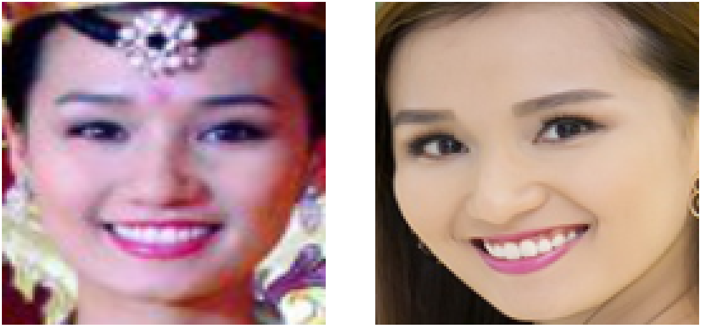    | 0.5237      | Khác người - trang điểm và kiểu tóc truyền thống tạo cảm giác nhận diện sai |

Nhận nhầm người xảy ra khi khoảng cách cosine giữa hai ảnh khác người nhỏ hơn ngưỡng. Điều này thường do **đặc điểm khuôn mặt khá tương đồng** (kiểu tóc, biểu cảm, góc chụp). Một số trường hợp khoảng cách chỉ nhỏ hơn ngưỡng một khoảng rất nhỏ nhưng vẫn là hai người khác nhau, cho thấy ngưỡng 0.7 có thể chưa đủ chặt trong một số trường hợp.

## Chức năng và giao diện

Hệ thống có giao diện thân thiện với các màn hình chính như:
*   Màn hình chính chấm công
*   Màn hình camera khi chấm công (hiển thị box khuôn mặt và vùng center)
*   Bảng điều khiển quản trị (chỉnh sửa cấu hình hệ thống)
*   Giao diện thêm nhân viên mới (nhập thông tin, thu thập ảnh, upload ảnh)
*   Giao diện hiển thị thông tin chấm công chi tiết
*   Các chức năng xóa nhân viên, thêm xóa bucket (công ty)


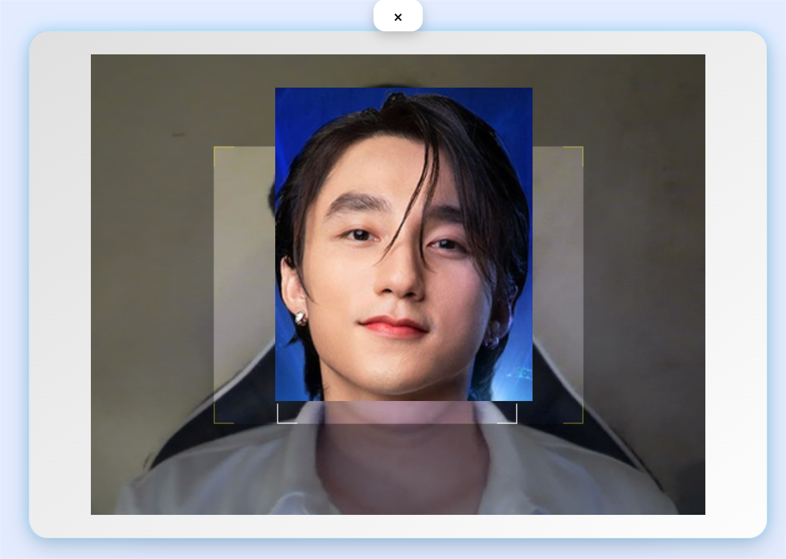


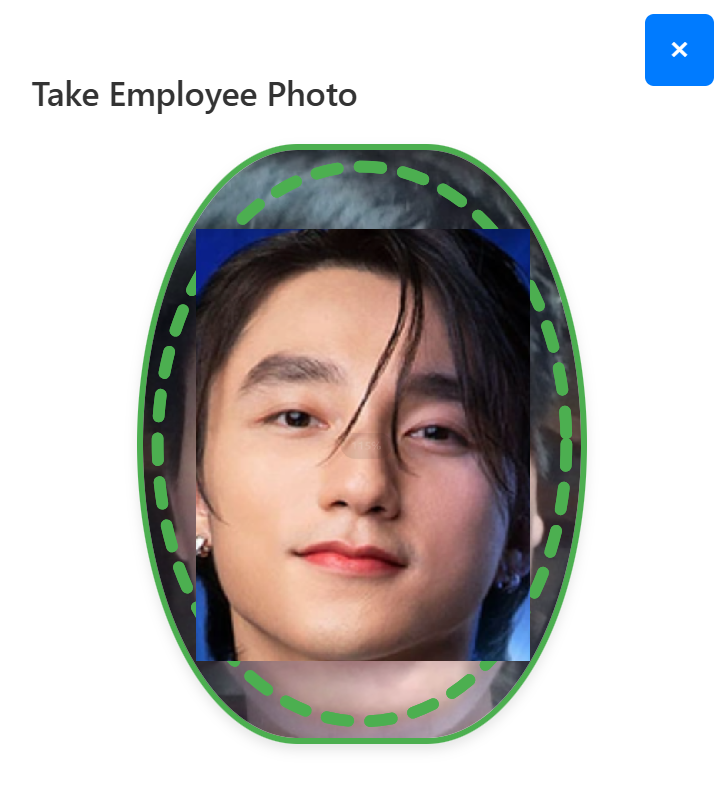


Hệ thống hoạt động ổn định, nhận diện chính xác và ghi lại thời gian ra vào tự động.

## Kết luận

Đồ án đã **xây dựng thành công hệ thống chấm công nhận diện khuôn mặt** với pipeline hoàn chỉnh và khả năng chống giả mạo cơ bản. Đề xuất hàm mất mát **CDML** giúp cải thiện khả năng tổng quát hóa. Các biến thể backbone **IResNet_Lite** cho phép đạt tốc độ suy luận nhanh, phù hợp thiết bị tài nguyên hạn chế. Hệ thống tích hợp với Firebase và Cloudinary cho phép quản lý dữ liệu realtime.

Tuy nhiên, hệ thống vẫn còn hạn chế trong việc xử lý các ảnh có biến đổi lớn, giao diện ở mức cơ bản phục vụ cho demo, và việc huấn luyện trên dữ liệu lớn bị giới hạn tài nguyên. Cần thực hiện thêm nhiều thử nghiệm với các tập dataset lớn hơn, nghiên cứu chuyển model sang các dạng tối ưu cho các thiết bị nhúng, hoàn thiện và phát triển giao diện quản trị hệ thống...

## Hướng phát triển trong tương lai

*   **Tối ưu hóa mô hình cho thiết bị nhúng:** Chuyển đổi mô hình sang ONNX, TensorRT, TFlite hoặc định dạng phần cứng AI chuyên dụng.
*   **Tăng cường chống giả mạo:** Tích hợp các kỹ thuật liveness detection tiên tiến (phân tích chuyển động mắt, phản xạ ánh sáng, cảm biến đa phổ).
*   **Huấn luyện trên bộ dữ liệu lớn và đa dạng hơn:** Sử dụng Glint360K hoặc IBUG-500K để cải thiện khả năng tổng quát hóa.
*   **Đầu tư thêm tài nguyên tính toán:** Cho phép huấn luyện với batch size và số epoch lớn hơn để đạt độ chính xác cao hơn.
*   **Phát triển giao diện người dùng:** Xây dựng giao diện đa nền tảng (web, desktop, mobile) với các tính năng quản lý nhân sự nâng cao.
*   **Mở rộng ứng dụng:** Triển khai hệ thống trong kiểm soát an ninh, giám sát ra vào, giáo dục, y tế, hoặc trên nền tảng edge computing.

## Dataset và Model Weights

### Dataset
Dataset được sử dụng trong đồ án bao gồm:
- **CASIA-WebFace**: Dataset chính cho việc huấn luyện mô hình
- **MS1MV3**: Dataset lớn hơn để tăng độ chính xác
- **VN-Celeb**: Dataset tự thu thập với 1131 danh tính và hơn 18000 ảnh người Việt

Link dataset: [Dataset Link](https://husteduvn-my.sharepoint.com/:f:/g/personal/ky_dn215410_sis_hust_edu_vn/Etlu7CZEWr5Ao1owHA9pOk0B-wwess_BZfVLEbZTcaWSvw?e=gVMQTf)

### Model Weights
Các model weights đã được huấn luyện có sẵn tại cùng link dataset, bao gồm:
- Các model được trình bày ở trên 
- Model MTCNN cho face detection
- Model FasNet cho anti-spoofing
- Model LightQnet cho căn chỉnh khuôn mặt


Link model_zoo: [Model Link](https://husteduvn-my.sharepoint.com/:f:/g/personal/ky_dn215410_sis_hust_edu_vn/Etlu7CZEWr5Ao1owHA9pOk0B-wwess_BZfVLEbZTcaWSvw?e=gVMQTf)


## Cấu trúc thư mục dự án

```
Facerecogtion/
├── models/
│   ├── Recognition/              # Chứa các model nhận diện khuôn mặt
│   │   └── Arcface_torch/        # Model ArcFace và các biến thể
│   ├── Detection/                # Model phát hiện khuôn mặt
|   ├── LightQNet/                # Model căn chỉnh khuôn mặt
│   └── Anti_spoof/               # Model chống giả mạo
├── data/                         # Dữ liệu huấn luyện và kiểm thử
├── database/                     # Xử lý và lưu trữ dữ liệu
├── interface/                    # Giao diện người dùng
├── infer/                        # Mã nguồn suy luận
├── eval_system/                  # Hệ thống đánh giá
├── notebooks/                    # Jupyter notebooks cho thử nghiệm
├── static/                       # Tài nguyên tĩnh
├── local_embeddings/             # Lưu trữ vector đặc trưng cục bộ
├── exports/                      # Xuất model và kết quả
├── audio/                        # Tài nguyên âm thanh
├── image_resources/              # Hình ảnh cho tài liệu
├── config.yaml                   # Cấu hình hệ thống
└── README.md                     # Tài liệu hướng dẫn
```

## Tài liệu tham khảo

[1] F. Schroff, D. Kalenichenko, and J. Philbin, "FaceNet: A unified embedding for face recognition and clustering," arXiv preprint arXiv:1503.03832, 2015.

[2] H. Wang et al., "CosFace: Large Margin Cosine Loss for Deep Face Recognition," arXiv preprint arXiv:1801.09414, 2018.

[3] J. Deng et al., "ArcFace: Additive Angular Margin Loss for Deep Face Recognition," in Proceedings of the IEEE/CVF Conference on Computer Vision and Pattern Recognition (CVPR), 2019, pp. 4690–4699.

[4] K. Zhang et al., "Joint Face Detection and Alignment using Multi-task Cascaded Convolutional Networks," arXiv preprint arXiv:1604.02878, 2016.

[5] MiniVision AI, "Silent Face Anti-Spoofing," https://github.com/minivision-ai/Silent-Face-Anti-Spoofing, Accessed: 2025-05-01, 2020.

[6] V. Bazarevsky et al., "BlazeFace: Sub-millisecond Neural Face Detection on Mobile GPUs," arXiv preprint arXiv:1907.05047, 2019.

[7] W. Liu et al., "SphereFace: Deep Hypersphere Embedding for Face Recognition," in Proceedings of the IEEE Conference on Computer Vision and Pattern Recognition (CVPR), 2017, pp. 212–220.

[8] X. An et al., "Killing Two Birds With One Stone: Efficient and Robust Training of Face Recognition CNNs by Partial FC," in Proceedings of the IEEE/CVF Conference on Computer Vision and Pattern Recognition (CVPR), 2022.

[9] Z. Zhu et al., "Webface260m: A benchmark unveiling the power of million-scale deep face recognition," in Proceedings of the IEEE/CVF Conference on Computer Vision and Pattern Recognition (CVPR), 2021.

[10] K. Chen, T. Yi and Q. Lv, "LightQNet: Lightweight Deep Face Quality Assessment for Risk-Controlled Face Recognition," in IEEE Signal Processing Letters, vol. 28, pp. 1878-1882, 2021.