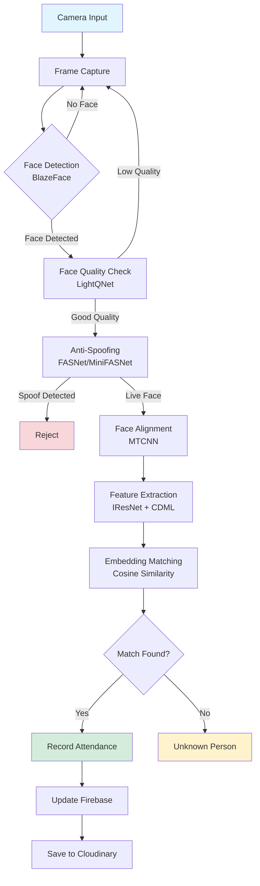

# Deep Learning-Based Face Recognition for Attendance System

<div align="center">


**An optimized deep learning system for face recognition-based attendance management with anti-spoofing capabilities**

[📖 Documentation](#documentation) • [🚀 Quick Start](docs/installation.md) • [📊 Results](docs/results.md) • [🎯 Features](#key-features)

</div>

---

## 📋 Table of Contents

- [Overview](#overview)
- [Key Features](#key-features)
- [System Architecture](#system-architecture)
- [Performance Highlights](#performance-highlights)
- [Documentation](#documentation)
- [Quick Start](#quick-start)
- [Project Structure](#project-structure)
- [Citation](#citation)
- [Contact](#contact)

## 🎯 Overview

This project presents a **comprehensive face recognition-based attendance system** designed to address the limitations of traditional manual attendance methods and existing facial recognition systems. The system combines state-of-the-art deep learning models to provide accurate, real-time face recognition with robust anti-spoofing capabilities.

The solution integrates multiple deep learning components into a complete pipeline that includes:
- **Face detection and alignment** using MTCNN and BlazeFace
- **Anti-spoofing detection** with FASNet/MiniFASNet to prevent presentation attacks
- **Face quality assessment** using LightQNet for optimal image selection
- **Feature extraction** with custom-trained models using the proposed CDML loss function
- **Real-time database integration** with Firebase for attendance management

**Author:** Dinh Nhat Ky  
**Supervisor:** MSc. Le Duc Trung  
**Institution:** School of Information and Communication Technology, Hanoi University of Science and Technology

## 🌟 Key Features

✨ **Advanced Recognition**
- Custom **Combined Dynamic Margin Loss (CDML)** for improved feature discrimination
- Lightweight **IResNet_Lite** architectures (r18/r50/r100_lite) optimized for resource-constrained devices
- Achieves **99.85% accuracy** on LFW and **98.94%** on CFP-FP benchmarks

🛡️ **Anti-Spoofing Protection**
- Real-time detection of presentation attacks (printed photos, video replay, masks)
- Multi-model integration for robust liveness detection

⚡ **High Performance**
- Fast inference speed: **16.82ms/image** for R18_lite on CPU
- Up to **70% reduction** in model parameters compared to standard architectures
- Real-time processing capability for production deployment

🔧 **Flexible System**
- Configurable pipeline components
- Firebase Realtime Database integration
- Cloudinary storage for embeddings and images
- User-friendly management interface

## 🏗️ System Architecture

The system implements a complete processing pipeline for face recognition-based attendance:



### Pipeline Components

The system consists of seven main stages:

1. **Frame Collection** - Capture frames from webcam with quality validation
2. **Anti-Spoofing** - Detect presentation attacks using FASNet/MiniFASNet
3. **Quality Assessment** - Evaluate face quality (angle, lighting, sharpness) with LightQNet
4. **Face Detection** - Accurate face localization and landmark detection using MTCNN
5. **Feature Extraction** - Generate 512-dimensional embeddings with trained IResNet models
6. **Identity Matching** - Compare embeddings using cosine similarity or Euclidean distance
7. **Attendance Recording** - Store results in Firebase with image backup on Cloudinary

For detailed architecture information, see [Architecture Documentation](docs/architecture.md).

## 📊 Performance Highlights

### Model Accuracy

| Dataset | r50_lite | r100_lite | CDML (R100) |
|---------|----------|-----------|-------------|
| **LFW** | 99.47% | 99.67% | **99.85%** |
| **CFP-FP** | 92.87% | 92.83% | **98.94%** |
| **AgeDB-30** | 96.35% | 95.95% | 97.75% |
| **CPLFW** | 88.83% | 89.08% | **94.08%** |

### Inference Speed

| Model | Parameters | Size (MB) | Inference Time (ms/image) | GFLOPs |
|-------|-----------|-----------|---------------------------|--------|
| R18 | 24.0M | 91.65 | 46.40 | 2.63 |
| **R18_lite** | **9.2M** | **35.70** | **16.82** | **0.67** |
| R100 | 65.2M | 248.55 | 194.91 | 12.13 |
| **R100_lite** | **19.5M** | **74.47** | **79.10** | **3.05** |

> 💡 The lite models achieve up to **70% parameter reduction** and **2.76x faster inference** while maintaining competitive accuracy.

For comprehensive results and analysis, see [Results Documentation](docs/results.md).

## 📚 Documentation

Detailed documentation is organized into the following sections:

| Document | Description |
|----------|-------------|
| [🏗️ Architecture](docs/architecture.md) | System design, pipeline flow, and component details |
| [🎓 Training](docs/training.md) | Model training methodology, CDML loss, and datasets |
| [📊 Results](docs/results.md) | Comprehensive experimental results and benchmarks |
| [⚙️ Installation](docs/installation.md) | Setup guide, requirements, and configuration |
| [💻 Usage Guide](docs/usage.md) | User interface, features, and API usage |
| [🔮 Future Work](docs/future-work.md) | Roadmap and planned improvements |
| [📖 References](docs/references.md) | Bibliography and citations |

## 🚀 Quick Start

### Prerequisites

- Python 3.8+
- CUDA-capable GPU (recommended) or CPU
- Webcam for real-time recognition

### Installation

```bash
# Clone the repository
git clone https://github.com/yourusername/DATN.git
cd DATN

# Install dependencies
pip install -r requirements.txt

# Download pre-trained models
# See docs/installation.md for detailed instructions
```

### Basic Usage

```python
# Run the attendance system
python main.py --config config.yaml

# Access the web interface
# Navigate to http://localhost:5000
```

For detailed installation and usage instructions, see the [Installation Guide](docs/installation.md) and [Usage Guide](docs/usage.md).

## 📁 Project Structure

```
DATN/
├── models/                      # Model implementations
│   ├── Recognition/            # Face recognition models
│   ├── Detection/              # Face detection models
│   ├── LightQNet/             # Face quality assessment
│   └── Anti_spoof/            # Anti-spoofing models
├── data/                       # Training and test data
├── database/                   # Database handlers
├── interface/                  # User interface
├── infer/                      # Inference code
├── eval_system/               # Evaluation scripts
├── docs/                       # Documentation
├── config.yaml                # System configuration
└── README.md                  # This file
```

## 📄 Citation

If you use this work in your research, please cite:

```bibtex
@mastersthesis{dinh2026facerecognition,
  title={Building an Optimized Deep Learning Model for Face Recognition in Corporate Attendance Systems},
  author={Dinh, Nhat Ky},
  year={2026},
  school={Hanoi University of Science and Technology},
  department={School of Information and Communication Technology}
}
```

## 📧 Contact

**Dinh Nhat Ky**  
📧 Email: Ky.dn215410@sis.hust.edu.vn  
🎓 Institution: Hanoi University of Science and Technology

**Supervisor: MSc. Le Duc Trung**

---

## 🔗 Resources

- [📦 Dataset & Model Weights](https://husteduvn-my.sharepoint.com/:f:/g/personal/ky_dn215410_sis_hust_edu_vn/Etlu7CZEWr5Ao1owHA9pOk0B-wwess_BZfVLEbZTcaWSvw?e=gVMQTf)
- [📖 Full Documentation](docs/)
- [🐛 Report Issues](https://github.com/yourusername/DATN/issues)

## 📜 License

This project is licensed under the MIT License - see the LICENSE file for details.

---

<div align="center">

**⭐ If you find this project useful, please consider giving it a star! ⭐**

Made with ❤️ by Dinh Nhat Ky

</div>