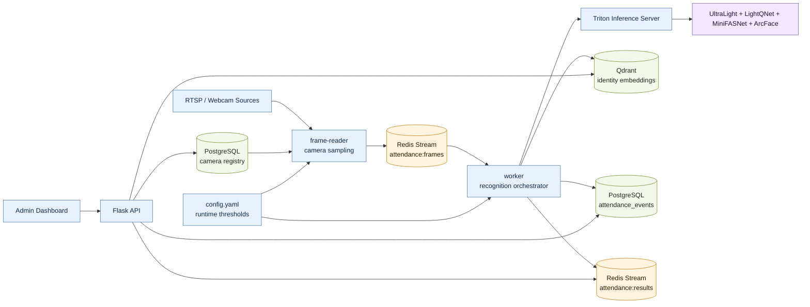

# Deep Learning-Based Face Recognition Attendance Platform

<div align="center">


**A production-oriented face recognition attendance platform with realtime camera ingestion, AI inference, vector search, event storage, and an Admin Dashboard.**

[Documentation](docs/) • [Architecture](docs/architecture.md) • [Installation](docs/installation.md) • [Usage](docs/usage.md) • [Operations](docs/operations.md) • [Research Results](docs/results.md)

</div>

---

## Overview

This project builds an end-to-end attendance system based on face recognition. It continuously reads frames from cameras, detects and validates faces, extracts ArcFace embeddings, searches identities in Qdrant, stores attendance events, and exposes a web dashboard for system administration.

The platform is designed around independent services so that camera ingestion, AI inference, vector search, storage, and administration can be operated and debugged separately.

**Author:** Dinh Nhat Ky  
**Institution:** School of Information and Communication Technology, Hanoi University of Science and Technology

## Core Capabilities

- Multi-camera RTSP/webcam ingestion.
- PostgreSQL camera registry and attendance event storage.
- Redis Streams for frame buffering and realtime result delivery.
- Triton-served AI models for detection, quality, liveness, and embedding.
- Qdrant vector search for identity recognition.
- Track-level multi-frame validation to reduce unstable single-frame decisions.
- Admin Dashboard for cameras, identities, thresholds, and system status.
- Docker Compose runtime for reproducible local/server deployment.

## System Overview


```mermaid
flowchart LR
    CamerasInput[RTSP / Webcam Sources] --> Reader[frame-reader\ncamera sampling]
    CameraDB[(PostgreSQL\ncamera registry)] --> Reader
    Config[config.yaml\nruntime thresholds] --> Reader

    Reader --> FrameStream[(Redis Stream\nattendance:frames)]
    FrameStream --> Worker[worker\nrecognition orchestrator]
    Config --> Worker

    Worker --> Triton[Triton Inference Server]
    Triton --> Models[UltraLight + LightQNet + MiniFASNet + ArcFace]
    Worker --> Qdrant[(Qdrant\nidentity embeddings)]
    Worker --> EventDB[(PostgreSQL\nattendance_events)]
    Worker --> ResultStream[(Redis Stream\nattendance:results)]

    Dashboard[Admin Dashboard] --> API[Flask API]
    API --> CameraDB
    API --> EventDB
    API --> Qdrant
    API --> ResultStream

    classDef service fill:#e8f1ff,stroke:#4c78a8,color:#102a43;
    classDef storage fill:#f4f7ec,stroke:#6b8e23,color:#1f2d16;
    classDef queue fill:#fff4df,stroke:#c27c0e,color:#2b1b00;
    classDef model fill:#f2e8ff,stroke:#7b61a8,color:#241137;
    class CamerasInput,Reader,Worker,Triton,API,Dashboard,Config service;
    class CameraDB,Qdrant,EventDB storage;
    class FrameStream,ResultStream queue;
    class Models model;
```

## Recognition Pipeline


```mermaid
flowchart LR
    Frame[Camera frame] --> Sample[Sample + rotate + JPEG encode]
    Sample --> Queue[Redis frame stream]
    Queue --> Detect[Face detection\nUltraLight]
    Detect --> Crop[Expanded face crop]
    Crop --> Track[Tracking\nByteTrack]
    Track --> Quality[Quality scoring\nLightQNet]
    Quality --> Live[Liveness check\nMiniFASNet]
    Live --> Embed[Face embedding\nArcFace 512-d]
    Embed --> Search[Identity search\nQdrant top-k cosine]
    Search --> Aggregate[Multi-frame track aggregation]
    Aggregate --> Result[Recognition result\nrecognized / unknown / pending / rejected]
    Result --> Store[PostgreSQL events]
    Result --> Stream[Redis result stream]
    Stream --> Dashboard[Admin Dashboard]
```

## Tech Stack

| Layer | Technology |
| --- | --- |
| Runtime | Docker Compose |
| API/Dashboard | Flask, Gunicorn |
| Camera input | RTSP / webcam |
| Camera ingestion | OpenCV VideoCapture / optional GStreamer |
| Queue | Redis Streams |
| Database | PostgreSQL |
| Vector search | Qdrant |
| Model serving | NVIDIA Triton Inference Server |
| Detection | Ultra-Light Face Detector |
| Tracking | ByteTrack |
| Quality | LightQNet |
| Liveness | MiniFASNet |
| Embedding | ArcFace-compatible ONNX model |

## Quick Start

```bash
cp .env.example .env
docker compose --profile pipeline up -d --build
```

Open the Admin Dashboard:

```text
http://localhost:5000
```

Enroll identities:

```bash
docker compose --profile pipeline run --rm worker \
  python -m pipeline.enroll_qdrant_identity_store \
  --config config.yaml \
  --dataset-root FacenetDataset
```

Check status:

```bash
curl http://localhost:5000/health
curl http://localhost:5000/system/status
curl "http://localhost:5000/results/recent?count=20"
```

## Documentation

| Document | Purpose |
| --- | --- |
| [Architecture](docs/architecture.md) | Detailed service architecture, data contracts, storage model, and diagrams |
| [Installation](docs/installation.md) | Environment setup, Docker Compose startup, and model checks |
| [Usage](docs/usage.md) | Dashboard usage, camera management, identity enrollment, API examples |
| [Operations](docs/operations.md) | Logs, health checks, Redis/PostgreSQL/Qdrant/Triton debug commands |
| [Triton Models](triton_model_repository/README.md) | Triton model repository layout and model input/output contracts |
| [Training](docs/training.md) | ArcFace/CDML training direction and production export path |
| [Results](docs/results.md) | Research accuracy, latency, threshold, and error analysis |
| [References](docs/references.md) | Bibliography and related work |
| [Future Work](docs/future-work.md) | Production and model roadmap |

## Repository Structure

```text
DATN/
├── config.yaml
├── docker-compose.yml
├── database/
│   └── init/
├── docs/
├── FacenetDataset/
├── models/
├── pipeline/
│   ├── api.py
│   ├── frame_reader.py
│   ├── worker.py
│   ├── orchestrator.py
│   ├── qdrant_identity_store.py
│   └── stages/
├── scripts/
└── triton_model_repository/
```

## Citation

```bibtex
@mastersthesis{dinh2026facerecognition,
  title  = {Building an Optimized Deep Learning Model for Face Recognition in Corporate Attendance Systems},
  author = {Dinh, Nhat Ky},
  year   = {2026},
  school = {Hanoi University of Science and Technology},
  note   = {School of Information and Communication Technology}
}
```
