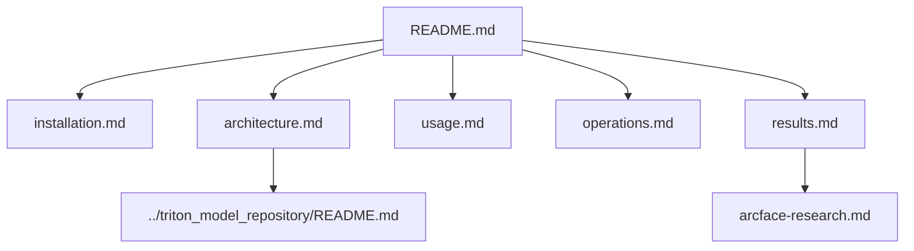

# Documentation

This directory contains the project documentation.

## Guides

| Page | Purpose |
| --- | --- |
| [Architecture](architecture.md) | Runtime architecture, data flow, storage model, and Mermaid diagrams |
| [Installation](installation.md) | Environment setup, Docker Compose startup, and model checks |
| [Usage](usage.md) | Dashboard usage, API calls, camera management, and enrollment |
| [Operations](operations.md) | Logs, health checks, Redis/PostgreSQL/Qdrant/Triton debug commands |
| [Training](training.md) | ArcFace/CDML research direction and model export path |
| [Results](results.md) | Accuracy, latency, threshold, and error analysis |
| [ArcFace Research](arcface-research.md) | Consolidated ArcFace/CDML research tables from the research branch |
| [Future Work](future-work.md) | Production roadmap |
| [References](references.md) | Bibliography and related work |

## Runtime Documentation Map

