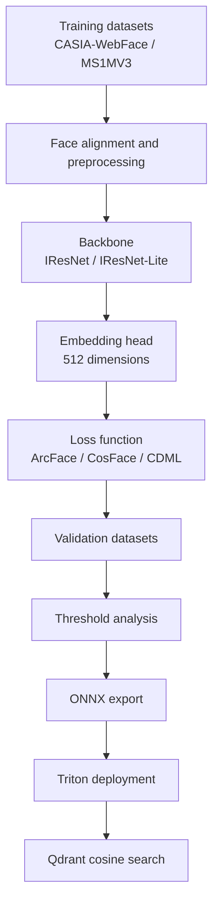

# ArcFace Research Summary

This document consolidates the recognition-model research results from the `main` branch and connects them to the current production pipeline.

The deployed system currently uses an ArcFace-compatible embedding model served by Triton and stores the generated 512-dimensional vectors in Qdrant. The research work explored whether ArcFace-style embedding learning can be improved with lightweight backbones and a proposed loss function named Combined Dynamic Margin Loss (CDML).

## Research Objective

The recognition model must satisfy two production constraints:

- High verification accuracy under pose, lighting, age, and expression variation.
- Low inference latency so the full attendance pipeline remains close to realtime.

The research therefore studied:

- ArcFace and other angular-margin losses.
- CDML as a dynamic-margin extension.
- IResNet and IResNet-Lite backbones.
- Training on CASIA-WebFace and MS1MV3.
- Evaluation on LFW, CFP-FP, CFP-FF, CALFW, CPLFW, AgeDB, IJB-B, and IJB-C.

## Research Pipeline

## Loss Function Findings

CDML was designed as a dynamic-margin variant of ArcFace. Instead of using one fixed angular margin for all samples, the margin is adjusted based on sample difficulty. This aims to improve separation for hard classes while keeping same-identity embeddings compact.

### CASIA-WebFace, ResNet50

| Loss function | LFW | CFP-FP | AgeDB |
| --- | ---: | ---: | ---: |
| CDML (0.49) | 99.58 | 93.86 | 96.62 |
| ArcFace (0.40) | 99.53 | 95.41 | 94.98 |
| ArcFace (0.45) | 99.46 | 95.47 | 94.93 |
| ArcFace (0.50) | 99.53 | 95.56 | 95.15 |
| ArcFace (0.55) | 99.41 | 95.32 | 95.05 |
| CosFace (0.35) | 99.51 | 95.44 | 94.56 |
| Softmax | 99.08 | 94.39 | 92.33 |
| Triplet (0.35) | 98.98 | 91.90 | 89.98 |

Interpretation:

- CDML achieved the best AgeDB score in this group.
- ArcFace variants remained stronger on CFP-FP in this specific experiment.
- CDML is competitive and may be preferable when robustness to age and hard samples is important.

## Lightweight Backbone Results

### CASIA-WebFace: ArcFace vs CDML

| Dataset | r18_lite ArcFace | r18_lite CDML | r50_lite ArcFace | r50_lite CDML |
| --- | ---: | ---: | ---: | ---: |
| LFW | 99.08 ± 0.46 | 98.92 ± 0.51 | 98.88 ± 0.57 | 99.17 ± 0.39 |
| CFP-FP | 91.24 ± 1.31 | 92.34 ± 1.21 | 92.57 ± 1.39 | 94.14 ± 1.29 |
| CFP-FF | 99.14 ± 0.28 | 99.10 ± 0.35 | 99.06 ± 0.50 | 99.31 ± 0.50 |
| CALFW | 92.63 ± 1.15 | 92.27 ± 1.42 | 91.77 ± 1.00 | 92.78 ± 1.12 |
| CPLFW | 85.13 ± 1.78 | 85.48 ± 2.49 | 86.57 ± 2.04 | 88.08 ± 1.89 |
| AgeDB-30 | 92.12 ± 1.19 | 92.22 ± 2.09 | 90.88 ± 2.10 | 93.85 ± 1.26 |

Interpretation:

- CDML improved r50_lite across all listed validation datasets.
- r18_lite was already fast, and CDML was comparable or slightly better on several harder datasets.
- r50_lite is the better research candidate when accuracy is more important than minimum latency.

### MS1MV3: r50_lite and r100_lite

| Dataset | r50_lite | r100_lite |
| --- | ---: | ---: |
| LFW | 99.47 ± 0.37 | 99.67 ± 0.27 |
| CFP-FP | 92.87 ± 1.41 | 92.83 ± 1.92 |
| CFP-FF | 99.57 ± 0.34 | 99.63 ± 0.31 |
| CALFW | 95.32 ± 1.02 | 95.10 ± 1.27 |
| CPLFW | 88.83 ± 1.63 | 89.08 ± 1.85 |
| AgeDB-30 | 96.35 ± 0.94 | 95.95 ± 0.91 |

Interpretation:

- Training on MS1MV3 improves generalization compared with smaller training sets.
- r50_lite and r100_lite are both viable, with r50_lite offering a better speed/accuracy balance.

## Comparison With Published-Style Baselines

| Method | CFP-FP | CPLFW | AgeDB | CALFW | LFW |
| --- | ---: | ---: | ---: | ---: | ---: |
| Center Loss | - | 77.48 | - | 85.48 | 99.28 |
| SphereFace | - | 81.40 | - | 90.30 | 99.42 |
| CurricularFace | 98.36 | 93.13 | 98.37 | 96.05 | - |
| MS1MV3, R100, ArcFace | 98.79 | 93.21 | 98.23 | 96.02 | 99.83 |
| IBUG500K, R100, ArcFace | 98.87 | 93.43 | 98.38 | 96.10 | 99.83 |
| MS1MV3, R100, CDML | 98.94 | 94.08 | 97.75 | 96.05 | 99.85 |
| MS1MV3, lightweight, CDML + distillation | 97.98 | 92.48 | 97.03 | 95.55 | 99.76 |

Interpretation:

- The R100 CDML result is strongest on CFP-FP, CPLFW, and LFW in this table.
- CALFW is essentially tied with top results.
- AgeDB is slightly lower than the strongest ArcFace baseline but remains high.

## IJB-B and IJB-C Results

### TPR@FPR=1e-4

| Method | IJB-B | IJB-C |
| --- | ---: | ---: |
| MS1MV3, R100, ArcFace | 95.42 | 96.83 |
| IBUG500K, R100, ArcFace | 96.02 | 97.27 |
| MS1MV3, r100_lite, CDML | 91.15 | 93.13 |
| MS1MV3, r50_lite, CDML | 90.83 | 93.15 |

### Full TPR Sweep

| Model | Dataset | 1e-6 | 1e-5 | 1e-4 | 0.001 | 0.01 | 0.1 |
| --- | --- | ---: | ---: | ---: | ---: | ---: | ---: |
| r100_lite | IJB-B | 36.85 | 83.57 | 91.15 | 94.30 | 96.87 | 98.33 |
| r100_lite | IJB-C | 83.06 | 89.50 | 93.13 | 95.56 | 97.59 | 98.82 |
| r50_lite | IJB-B | 36.11 | 83.61 | 90.83 | 94.35 | 96.81 | 98.49 |
| r50_lite | IJB-C | 83.78 | 89.42 | 93.15 | 95.64 | 97.65 | 98.88 |

Interpretation:

- Lightweight CDML models are weaker than full R100 ArcFace on IJB-B/IJB-C, but still provide usable verification performance.
- For a production attendance system, these models are attractive when CPU latency and model size matter.

## Inference Cost

CPU benchmark with input size `112x112`:

| Backbone | Parameters | Size | CPU latency / image | GFLOPs |
| --- | ---: | ---: | ---: | ---: |
| R18 | 24,025,600 | 91.65 MB | 46.40 ms | 2.63 |
| R34 | 34,139,328 | 130.20 MB | 74.92 ms | 4.48 |
| R50 | 43,590,848 | 166.28 MB | 108.02 ms | 6.33 |
| R100 | 65,156,160 | 248.55 MB | 194.91 ms | 12.13 |
| R18_lite | 9,222,656 | 35.70 MB | 16.82 ms | 0.67 |
| R34_lite | 11,754,336 | 44.84 MB | 26.20 ms | 1.13 |
| R50_lite | 14,120,800 | 53.87 MB | 39.39 ms | 1.60 |
| R100_lite | 19,521,312 | 74.47 MB | 79.10 ms | 3.05 |
| R_lightweight | 5,086,432 | 19.43 MB | 8.71 ms | 0.098 |

Other pipeline model costs from the research branch:

| Model | Parameters | CPU latency / image | Size |
| --- | ---: | ---: | ---: |
| MTCNN | 495,850 | 289.60 ms | 446.21 MB |
| FASNet | 868,146 | 35.93 ms | 211.59 MB |
| LightQNet | 130,915 | 11.17 ms | 444.84 MB |

Production implication:

- MTCNN is accurate but too slow for the current realtime CPU-oriented pipeline.
- The current runtime uses UltraLight detector for speed.
- LightQNet and FASNet are small enough to remain in the realtime pipeline, depending on hardware.

## Threshold Research

The research branch evaluated a VN-Celeb dataset with 1,131 identities and more than 18,000 images.

Observed threshold behavior:

- TAR and accuracy increased quickly and peaked around a cosine-distance threshold near `0.70`.
- FAR increased when the threshold became too permissive.
- FRR decreased as the system accepted more samples.
- Precision stayed high while recall showed the expected threshold trade-off.
- The estimated operating threshold was around `0.705`, with mean positive distance `0.452` and mean negative distance `0.958`.

Important runtime note:

- The research threshold above was based on distance-style evaluation.
- Qdrant returns cosine similarity scores, where higher is better.
- Therefore `qdrant.match_threshold` in the current system must be calibrated with the actual deployed embedding model and Qdrant score distribution.

## Error Analysis

False rejects were mostly caused by:

- Large pose differences.
- Blur or low quality.
- Age differences.
- Expression changes.
- Black-white/color domain differences.

False accepts were mostly caused by:

- Similar facial structure.
- Similar hairstyle or makeup.
- Similar pose and expression.
- Low contrast backgrounds.
- Thresholds that were too permissive for hard negative pairs.

Production mitigation:

- Keep LightQNet quality filtering enabled.
- Use multiple images per identity during enrollment.
- Use track-level aggregation instead of a single-frame decision.
- Calibrate Qdrant threshold on the target deployment population.
- Keep `unknown` as a valid outcome instead of forcing the nearest identity.

## Runtime Integration

The current production stack is intentionally decoupled from the training code:

- Training and research artifacts live in the research branch.
- Runtime only requires exported ONNX models under `triton_model_repository`.
- Identity enrollment writes embeddings to Qdrant with payload metadata.
- The `worker` service performs online search through Qdrant.

## Recommended Production Path

1. Keep the current ArcFace-compatible Triton model as the stable baseline.
2. Export the best research model, preferably `r50_lite` or `r100_lite`, to ONNX.
3. Add it as a new Triton model version or model name.
4. Re-enroll identities into a separate Qdrant collection.
5. Calibrate `match_threshold` on the target deployment dataset.
6. Compare recognition accuracy, false accepts, false rejects, and latency before replacing the baseline.

## References

- Deng et al., "ArcFace: Additive Angular Margin Loss for Deep Face Recognition", CVPR 2019.
- Wang et al., "CosFace: Large Margin Cosine Loss for Deep Face Recognition", 2018.
- An et al., "Killing Two Birds With One Stone: Efficient and Robust Training of Face Recognition CNNs by Partial FC", CVPR 2022.
- Zhu et al., "WebFace260M: A Benchmark Unveiling the Power of Million-Scale Deep Face Recognition", CVPR 2021.
- Chen et al., "LightQNet: Lightweight Deep Face Quality Assessment for Risk-Controlled Face Recognition", IEEE Signal Processing Letters, 2021.
