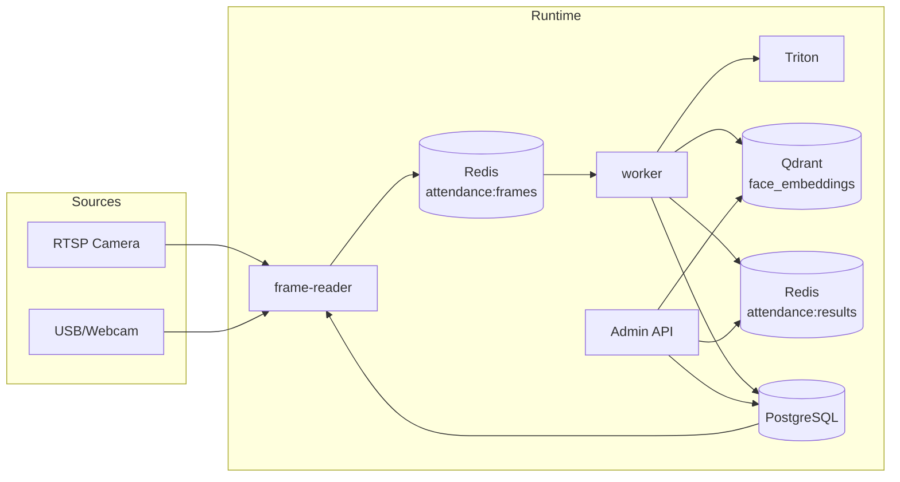
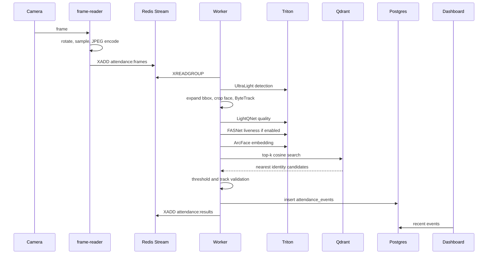
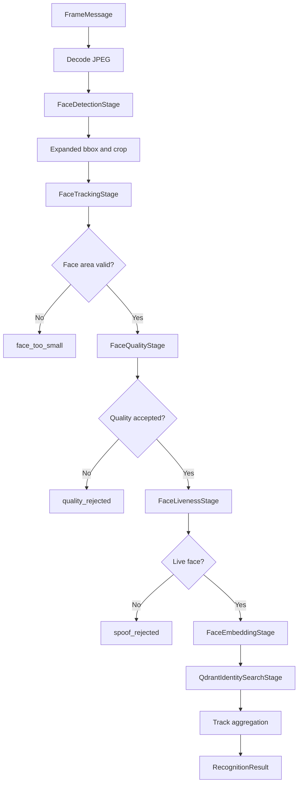
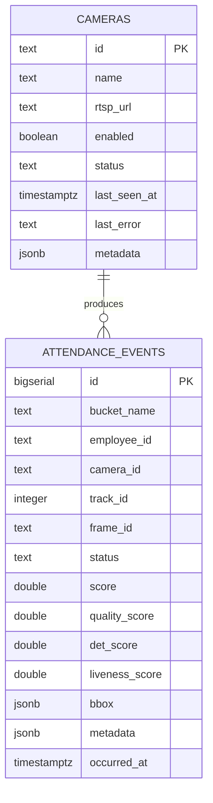

# System Architecture

This document describes the production runtime architecture of the face attendance platform.

## Service Overview

| Service | Module | Responsibility |
| --- | --- | --- |
| `redis` | Redis 7 | Frame queue and realtime result stream |
| `postgres` | PostgreSQL 16 | Camera registry and attendance event history |
| `qdrant` | Qdrant | Identity vector database |
| `triton` | NVIDIA Triton | Model inference serving |
| `frame-reader` | `pipeline.frame_reader` | Reads enabled cameras and pushes frames to Redis |
| `worker` | `pipeline.worker` | Runs recognition pipeline and writes results |
| `api` | `pipeline.api` | Admin Dashboard and REST API |

## High-Level Architecture

```mermaid
flowchart LR
    subgraph Sources
        C1[RTSP Camera]
        C2[USB/Webcam]
    end

    subgraph Runtime
        FR[frame-reader]
        RQ[(Redis\nattendance:frames)]
        W[worker]
        TR[Triton]
        QR[(Qdrant\nface_embeddings)]
        RS[(Redis\nattendance:results)]
        PG[(PostgreSQL)]
        API[Admin API]
    end

    C1 --> FR
    C2 --> FR
    PG --> FR
    FR --> RQ
    RQ --> W
    W --> TR
    W --> QR
    W --> RS
    W --> PG
    API --> PG
    API --> QR
    API --> RS
```

## Recognition Sequence

```mermaid
sequenceDiagram
    participant Camera
    participant Reader as frame-reader
    participant Redis as Redis Stream
    participant Worker
    participant Triton
    participant Qdrant
    participant Postgres
    participant Dashboard

    Camera->>Reader: frame
    Reader->>Reader: rotate, sample, JPEG encode
    Reader->>Redis: XADD attendance:frames
    Worker->>Redis: XREADGROUP
    Worker->>Triton: UltraLight detection
    Worker->>Worker: expand bbox, crop face, ByteTrack
    Worker->>Triton: LightQNet quality
    Worker->>Triton: FASNet liveness if enabled
    Worker->>Triton: ArcFace embedding
    Worker->>Qdrant: top-k cosine search
    Qdrant-->>Worker: nearest identity candidates
    Worker->>Worker: threshold and track validation
    Worker->>Postgres: insert attendance_events
    Worker->>Redis: XADD attendance:results
    Dashboard->>Postgres: recent events
```

## Worker Pipeline

```mermaid
flowchart TD
    A[FrameMessage] --> B[Decode JPEG]
    B --> C[FaceDetectionStage]
    C --> D[Expanded bbox and crop]
    D --> E[FaceTrackingStage]
    E --> F{Face area valid?}
    F -- No --> S1[face_too_small]
    F -- Yes --> G[FaceQualityStage]
    G --> H{Quality accepted?}
    H -- No --> S2[quality_rejected]
    H -- Yes --> I[FaceLivenessStage]
    I --> J{Live face?}
    J -- No --> S3[spoof_rejected]
    J -- Yes --> K[FaceEmbeddingStage]
    K --> L[QdrantIdentitySearchStage]
    L --> M[Track aggregation]
    M --> N[RecognitionResult]
```

## Data Contracts

### FrameMessage

Created by `frame-reader` and stored in `attendance:frames`.

| Field | Type | Description |
| --- | --- | --- |
| `camera_id` | string | Camera identifier |
| `frame_id` | string | UUID per sampled frame |
| `timestamp` | float | Unix timestamp |
| `image_jpeg_b64` | string | Base64 JPEG frame |

### FaceDetection

Created by `FaceDetectionStage`.

| Field | Type | Description |
| --- | --- | --- |
| `bbox` | list[int] | Expanded bbox used by downstream stages |
| `score` | float | Detector confidence |
| `crop_jpeg_b64` | string | Expanded face crop encoded as JPEG |
| `crop_bbox` | list[int] | Expanded crop bbox |

### RecognitionResult

Written to PostgreSQL and Redis.

| Field | Type | Description |
| --- | --- | --- |
| `bucket_name` | string | Tenant/company bucket |
| `employee_id` | string | Recognized ID or `UNKNOWN` |
| `track_id` | int | ByteTrack ID |
| `score` | float/null | Identity cosine score |
| `status` | string | `recognized`, `unknown`, `pending`, or rejection status |
| `timestamp` | float | Unix timestamp |
| `metadata` | object | Camera, frame, bbox, quality, liveness, vote fields |

## Storage Model

```mermaid
erDiagram
    CAMERAS {
        text id PK
        text name
        text rtsp_url
        boolean enabled
        text status
        timestamptz last_seen_at
        text last_error
        jsonb metadata
    }

    ATTENDANCE_EVENTS {
        bigserial id PK
        text bucket_name
        text employee_id
        text camera_id
        integer track_id
        text frame_id
        text status
        double score
        double quality_score
        double det_score
        double liveness_score
        jsonb bbox
        jsonb metadata
        timestamptz occurred_at
    }

    CAMERAS ||--o{ ATTENDANCE_EVENTS : produces
```

Qdrant collection:

| Payload field | Description |
| --- | --- |
| `bucket_name` | Tenant/company scope |
| `employee_id` | Identity label |
| `image_path` | Enrollment image path |
| `det_score` | Detector confidence during enrollment |
| `quality_score` | LightQNet score during enrollment |
| `bbox` | Enrollment face bbox |
| `model_name` | Embedding model name |
| `active` | Whether the vector participates in search |

## Design Notes

- Redis decouples camera ingestion from recognition latency.
- PostgreSQL is the source of truth for cameras and event history.
- Qdrant keeps identity search scalable and operationally manageable.
- Triton isolates model serving from pipeline orchestration.
- The dashboard is operational tooling, not part of the recognition critical path.
