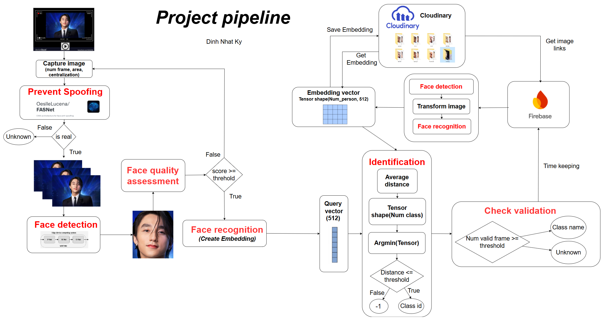

# System Architecture

[← Back to Main README](../README.md)

## Table of Contents

- [Overview](#overview)
- [System Pipeline](#system-pipeline)
- [Component Details](#component-details)
- [Technology Stack](#technology-stack)
- [Integration Architecture](#integration-architecture)

## Overview

The face recognition-based attendance system is built on a modular pipeline architecture that processes video frames through multiple deep learning models. The system is designed for real-time operation with robust anti-spoofing protection and high accuracy recognition.

## System Pipeline

The complete processing pipeline consists of seven sequential stages:

```mermaid
graph TB
    subgraph Input["📹 Input Layer"]
        A[Camera/Video Stream]
    end
    
    subgraph Detection["🔍 Detection & Quality"]
        B[BlazeFace<br/>Fast Detection]
        C[LightQNet<br/>Quality Assessment]
        D[MTCNN<br/>Precise Detection]
    end
    
    subgraph Security["🛡️ Security Layer"]
        E[FASNet/MiniFASNet<br/>Anti-Spoofing]
    end
    
    subgraph Recognition["🎯 Recognition Layer"]
        F[IResNet + CDML<br/>Feature Extraction]
        G[Embedding Matching<br/>Cosine Similarity]
    end
    
    subgraph Storage["💾 Storage Layer"]
        H[(Firebase<br/>Realtime DB)]
        I[(Cloudinary<br/>Image Storage)]
    end
    
    subgraph Output["✅ Output"]
        J[Attendance Record]
    end
    
    A --> B
    B --> C
    C -->|Quality OK| D
    C -->|Low Quality| A
    D --> E
    E -->|Live Face| F
    E -->|Spoof Detected| K[Reject]
    F --> G
    G -->|Match| J
    G -->|No Match| L[Unknown]
    J --> H
    J --> I
    
    style A fill:#e1f5ff
    style E fill:#fff3cd
    style G fill:#d4edda
    style K fill:#f8d7da
```



### Pipeline Flow Diagram



The above diagram illustrates the detailed workflow from frame capture to attendance recording.

## Component Details

### 1. Frame Collection

**Purpose:** Capture and validate video frames from webcam input

**Process:**
- Continuous frame sampling from webcam
- Quality validation (face area, centering)
- BlazeFace for fast initial detection

**Performance:**
- Real-time processing at 30 FPS
- Minimal latency for user experience

### 2. Anti-Spoofing Detection

**Purpose:** Prevent presentation attacks (printed photos, video replay, masks)

**Models:**
- **FASNet** - Primary anti-spoofing model
- **MiniFASNet** - Lightweight alternative

**Detects:**
- Printed photographs
- Screen displays/video replay
- 3D masks
- Other presentation attacks

**Specifications:**

| Model | Parameters | Inference Time | Size |
|-------|-----------|----------------|------|
| FasNet | 868,146 | 35.93 ms/image | 211.59 MB |

### 3. Face Quality Assessment

**Purpose:** Filter out poor-quality face images before recognition

**Model:** LightQNet

**Evaluates:**
- Pose angle
- Lighting conditions
- Image sharpness and blur
- Face size
- Overall quality score

**Specifications:**

| Model | Parameters | Inference Time | Size |
|-------|-----------|----------------|------|
| LightQNet | 130,915 | 11.17 ms/image | 444.84 MB |

### 4. Face Detection and Alignment

**Purpose:** Accurate face localization and standardization

**Model:** MTCNN (Multi-task Cascaded Convolutional Networks)

**Features:**
- Precise face bounding box detection
- Facial landmark detection (eyes, nose, mouth)
- Face alignment and normalization
- Resize to standard 112×112 input

**Specifications:**

| Model | Parameters | Inference Time | Size |
|-------|-----------|----------------|------|
| MTCNN | 495,850 | 289.60 ms/image | 446.21 MB |

> **Note:** MTCNN can be optimized with batch processing (batch size > 1) to reduce per-image latency.

### 5. Feature Extraction

**Purpose:** Generate discriminative face embeddings

**Models:**
- **IResNet_Lite** variants (r18_lite, r50_lite, r100_lite)
- Trained with custom **CDML** (Combined Dynamic Margin Loss)

**Output:**
- 512-dimensional embedding vector
- Normalized for similarity comparison

**Model Comparison:**

| Model | Parameters | Size (MB) | Inference (ms) | GFLOPs |
|-------|-----------|-----------|----------------|--------|
| R18_lite | 9.2M | 35.70 | **16.82** | 0.67 |
| R50_lite | 14.1M | 53.87 | 39.39 | 1.60 |
| R100_lite | 19.5M | 74.47 | 79.10 | 3.05 |

### 6. Identity Matching

**Purpose:** Compare query embedding with database entries

**Method:**
- Cosine similarity or Euclidean distance
- Average distance to multiple stored embeddings per identity
- Threshold-based decision

**Optimal Threshold:**
- Cosine similarity: **0.705**
- Balances True Accept Rate (TAR) and False Accept Rate (FAR)

**Decision Process:**


### 7. Multi-Frame Validation

**Purpose:** Improve reliability through temporal consistency

**Process:**
- Collect results from multiple valid frames
- Require consistent identity across frames
- Reduce false positives from single-frame errors

**Parameters:**
- Minimum frames required: Configurable
- Consistency threshold: Configurable

## Technology Stack

### Deep Learning Frameworks

- **PyTorch** - Primary framework for model training and inference
- **TorchVision** - Computer vision utilities
- **ONNX** (planned) - Model export for deployment

### Models and Algorithms

| Component | Model/Algorithm | Purpose |
|-----------|----------------|---------|
| Fast Detection | BlazeFace | Initial face detection |
| Precise Detection | MTCNN | Face alignment and landmarks |
| Quality Assessment | LightQNet | Face quality scoring |
| Anti-Spoofing | FASNet/MiniFASNet | Liveness detection |
| Feature Extraction | IResNet_Lite + CDML | Generate embeddings |
| Matching | Cosine Similarity | Identity comparison |

### Backend Services

- **Firebase Realtime Database**
  - Employee information storage
  - Attendance records
  - System configuration
  - Real-time synchronization

- **Cloudinary**
  - Image storage and CDN
  - Embedding vector storage
  - Scalable asset management

### Programming Stack

- **Python 3.8+** - Core implementation language
- **OpenCV** - Image processing and webcam interface
- **NumPy** - Numerical computations
- **Flask/FastAPI** - Web interface (optional)

## Integration Architecture


### Data Flow

1. **Enrollment Phase:**
   - User interface → Capture employee photos
   - Pipeline → Process and generate embeddings
   - Cloudinary → Store original images
   - Firebase → Store employee metadata and embedding references

2. **Recognition Phase:**
   - Camera → Capture frame
   - Pipeline → Process through all stages
   - Local Cache → Quick lookup for frequent employees
   - Firebase → Record attendance with timestamp
   - Cloudinary → Store attendance snapshot (optional)

3. **Management Phase:**
   - UI → View/edit employee data
   - Firebase → Real-time updates
   - Config → Adjust threshold, pipeline settings

### Configuration Management

The system uses `config.yaml` for centralized configuration:

```yaml
# Example configuration structure
pipeline:
  detection_model: "blazeface"
  quality_threshold: 0.5
  anti_spoofing: true
  embedding_model: "r50_lite"
  
matching:
  similarity_metric: "cosine"
  threshold: 0.705
  min_frames: 3
  
firebase:
  project_id: "your-project-id"
  database_url: "your-database-url"
  
cloudinary:
  cloud_name: "your-cloud-name"
  api_key: "your-api-key"
```

---

## Component Dependencies


---

[📚 Training Documentation →](training.md)

[← Back to Main README](../README.md)
