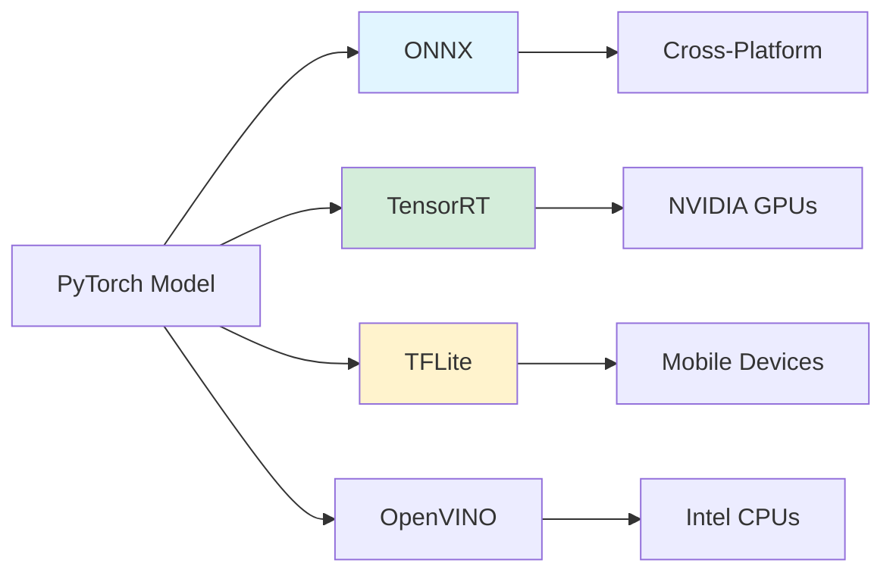
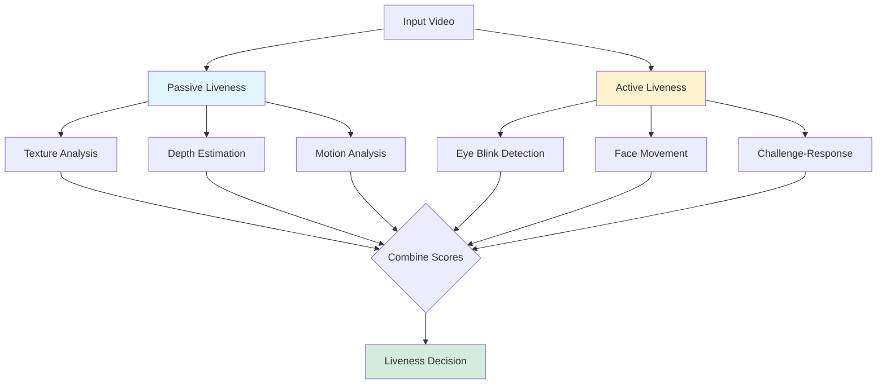
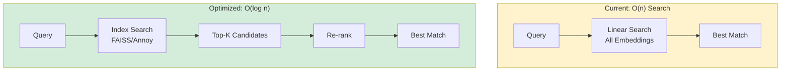
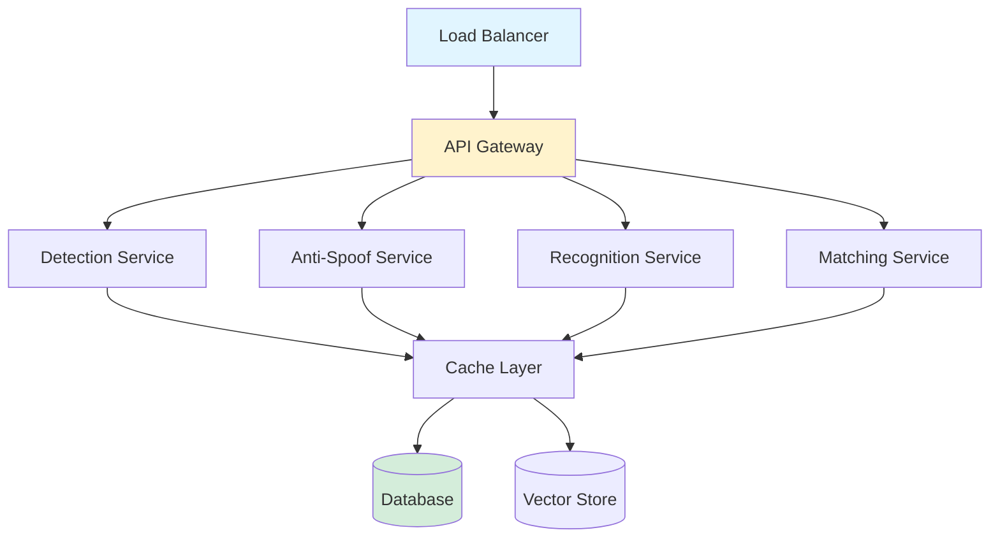

# Future Work and Roadmap

[← Back to Main README](../README.md)

## Table of Contents

- [Overview](#overview)
- [Model Optimization](#model-optimization)
- [Enhanced Security](#enhanced-security)
- [Scalability Improvements](#scalability-improvements)
- [Extended Applications](#extended-applications)
- [Research Directions](#research-directions)

## Overview

This document outlines planned improvements and future development directions for the face recognition attendance system. The roadmap focuses on optimization, security, scalability, and expanding application domains.

## Model Optimization

### 1. Embedded Device Deployment

**Goal:** Deploy the system on resource-constrained edge devices (Raspberry Pi, Jetson Nano, mobile devices)

**Planned Optimizations:**



#### ONNX Export

**Benefits:**
- Cross-platform compatibility
- Hardware acceleration support
- Reduced deployment complexity

**Implementation Plan:**
```python
# Convert PyTorch model to ONNX
torch.onnx.export(
    model,
    dummy_input,
    "r50_lite.onnx",
    opset_version=11,
    input_names=['input'],
    output_names=['output'],
    dynamic_axes={'input': {0: 'batch_size'}}
)
```

**Expected Improvements:**
- 20-30% inference speedup
- Easier deployment across platforms
- Better optimization opportunities

#### TensorRT Optimization

**Target:** NVIDIA Jetson devices, GTX/RTX GPUs

**Benefits:**
- 2-5× faster inference on NVIDIA hardware
- FP16/INT8 quantization support
- Optimized kernel fusion

**Expected Performance:**

| Model | PyTorch (ms) | TensorRT FP16 (ms) | Speedup |
|-------|-------------|-------------------|---------|
| r18_lite | 16.82 | ~5-7 | 2.4-3.4× |
| r50_lite | 39.39 | ~12-15 | 2.6-3.3× |
| r100_lite | 79.10 | ~25-30 | 2.6-3.2× |

#### TensorFlow Lite

**Target:** Mobile devices (Android/iOS) and edge devices

**Benefits:**
- Extremely small model size
- Optimized for mobile CPUs
- On-device inference

**Quantization Strategy:**
- Post-training quantization (INT8)
- Quantization-aware training
- Mixed precision (FP16)

**Expected Results:**
- Model size: 50-75% reduction
- Inference speed: 2-3× faster on mobile
- Accuracy drop: <1%

### 2. Model Compression

**Techniques:**

✅ **Knowledge Distillation**
- Train smaller student models from larger teacher models
- Maintain accuracy while reducing size
- Target: r18_lite student from R100 teacher

✅ **Pruning**
- Remove redundant weights and channels
- Structured vs. unstructured pruning
- Expected: 30-40% parameter reduction

✅ **Quantization**
- INT8 quantization for deployment
- Minimal accuracy loss (<1%)
- 4× memory reduction, 2-3× speed improvement

### 3. Architecture Search

**Neural Architecture Search (NAS):**
- Automated discovery of optimal architectures
- Hardware-aware NAS for specific deployment targets
- Multi-objective optimization (accuracy vs. speed vs. size)

**Target Metrics:**
- Accuracy ≥ 99% on LFW
- Inference < 10ms on mobile CPU
- Model size < 10MB

## Enhanced Security

### 1. Advanced Anti-Spoofing

Current system uses basic anti-spoofing. Planned enhancements:



#### Passive Liveness Detection

**Techniques:**

1. **Depth Estimation**
   - Monocular depth prediction
   - Detect 2D vs 3D faces
   - Resistant to printed photos and screens

2. **Texture Analysis**
   - Analyze micro-textures
   - Detect print artifacts
   - Screen moire pattern detection

3. **Remote Photoplethysmography (rPPG)**
   - Detect blood flow from face color changes
   - Requires live person
   - Non-intrusive measurement

#### Active Liveness Detection

**Techniques:**

1. **Eye Blink Detection**
   - Verify natural blinking patterns
   - Frequency and duration analysis

2. **Face Movement Tracking**
   - Request head rotation
   - Verify 3D structure

3. **Challenge-Response**
   - Random instructions (smile, turn left)
   - Time-bounded responses

### 2. Multi-Factor Authentication

Combine face recognition with additional factors:

- **PIN/Password** - Knowledge factor
- **RFID Badge** - Possession factor
- **Fingerprint** - Additional biometric
- **Location** - Geofencing verification

### 3. Privacy Enhancements

**Homomorphic Encryption:**
- Encrypted embedding matching
- Privacy-preserving authentication
- Compliance with GDPR/privacy regulations

**Federated Learning:**
- Distributed model updates
- No raw image sharing
- Privacy-by-design architecture

## Scalability Improvements

### 1. Large-Scale Deployment

**Target:** Support 10,000+ employees per organization

**Optimizations:**



#### Vector Index Systems

**FAISS (Facebook AI Similarity Search):**
```python
import faiss

# Build index
index = faiss.IndexFlatL2(512)  # 512-dim embeddings
index.add(embeddings_database)

# Fast search
distances, indices = index.search(query_embedding, k=5)
```

**Expected Performance:**
- Search time: O(log n) vs O(n)
- 10-100× faster for large databases
- Scalable to millions of identities

**Annoy (Approximate Nearest Neighbors):**
- Memory-efficient
- Disk-based indexing
- Excellent for read-heavy workloads

### 2. Distributed Architecture

**Microservices Design:**



**Benefits:**
- Independent scaling of components
- Better resource utilization
- Fault tolerance
- Easy updates and maintenance

### 3. Cloud Deployment

**Kubernetes Orchestration:**
- Auto-scaling based on load
- High availability
- Rolling updates
- Resource optimization

**Serverless Options:**
- AWS Lambda, Google Cloud Functions
- Pay-per-use pricing
- Automatic scaling
- Reduced operational overhead

## Extended Applications

### 1. Access Control Systems

- **Building Entry:** Integrate with door locks and turnstiles
- **Secure Areas:** Multi-level authorization
- **Visitor Management:** Temporary access control

### 2. Education Sector

- **Class Attendance:** Automated student attendance
- **Exam Verification:** Identity verification during exams
- **Library Access:** Smart library systems

### 3. Healthcare

- **Patient Identification:** Reduce medical errors
- **Staff Access:** Restricted area control
- **Prescription Verification:** Ensure correct patient

### 4. Retail and Hospitality

- **VIP Recognition:** Personalized customer service
- **Loss Prevention:** Known shoplifter detection
- **Loyalty Programs:** Automatic customer recognition

### 5. Smart Home/Office

- **Personalized Environment:** Auto-adjust temperature, lighting
- **Device Access:** Secure device unlocking
- **Activity Logging:** Presence tracking

## Research Directions

### 1. Continual Learning

**Problem:** Models become outdated as appearances change

**Solution:**
- Online learning from new samples
- Adaptation to aging effects
- Incremental class learning

### 2. Cross-Domain Recognition

**Challenges:**
- Different cameras and lighting
- Sketch-to-photo matching
- Low-resolution to high-resolution

**Approaches:**
- Domain adaptation techniques
- Multi-domain training
- Style transfer preprocessing

### 3. Masked Face Recognition

**COVID-19 Impact:** Widespread mask usage

**Strategies:**
- Periocular region focus (eyes, eyebrows)
- Masked face datasets
- Attention mechanisms for visible features

### 4. Explainable AI

**Interpretability:**
- Visualization of discriminative features
- Confidence explanation
- Decision transparency

**Tools:**
- Grad-CAM visualizations
- Attention maps
- Feature importance analysis

### 5. Fairness and Bias Mitigation

**Goals:**
- Equal performance across demographics
- Bias detection and mitigation
- Diverse training data

**Metrics:**
- Demographic parity
- Equal opportunity
- Balanced accuracy across groups

## Timeline and Priorities

### Short-Term (3-6 months)

🎯 **High Priority:**
- [ ] ONNX export for cross-platform deployment
- [ ] FAISS integration for faster search
- [ ] Enhanced anti-spoofing with rPPG
- [ ] Mobile app prototype (React Native)

🎯 **Medium Priority:**
- [ ] Kubernetes deployment scripts
- [ ] API documentation and SDKs
- [ ] Performance monitoring dashboard

### Medium-Term (6-12 months)

🎯 **High Priority:**
- [ ] TensorRT optimization for NVIDIA devices
- [ ] TFLite models for mobile deployment
- [ ] Multi-factor authentication
- [ ] Advanced liveness detection (active + passive)

🎯 **Medium Priority:**
- [ ] Federated learning framework
- [ ] Masked face recognition module
- [ ] Edge device SDKs (Jetson, RPI)

### Long-Term (12+ months)

🎯 **Research & Innovation:**
- [ ] Neural architecture search
- [ ] Continual learning system
- [ ] Explainable AI features
- [ ] Privacy-preserving mechanisms
- [ ] Large-scale deployment (10K+ users)

---

## Contributing

We welcome contributions in any of these areas! See [CONTRIBUTING.md](../CONTRIBUTING.md) for guidelines.

---

[📖 View References →](references.md)

[← Usage](usage.md) | [References →](references.md)

[← Back to Main README](../README.md)
