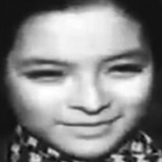
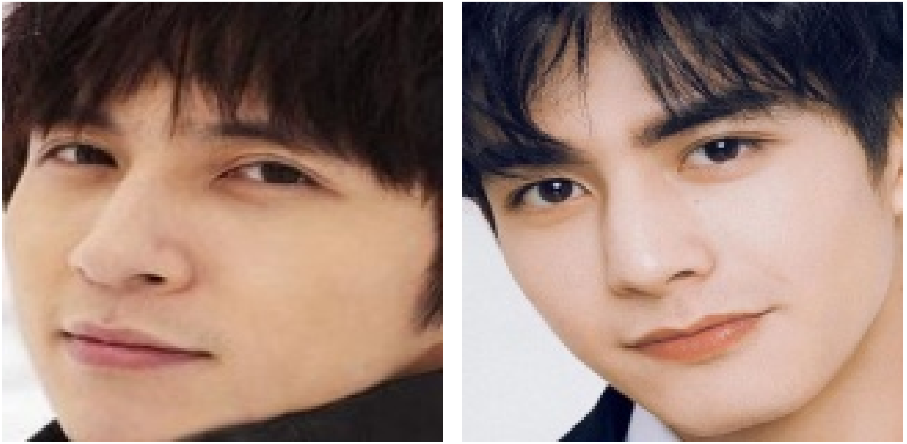

# Experimental Results

[← Back to Main README](../README.md)

## Table of Contents

- [Overview](#overview)
- [Loss Function Comparison](#loss-function-comparison)
- [Backbone Architecture Evaluation](#backbone-architecture-evaluation)
- [Large-Scale Training Results](#large-scale-training-results)
- [Inference Performance](#inference-performance)
- [System-Level Evaluation](#system-level-evaluation)
- [Error Analysis](#error-analysis)

## Overview

This document presents comprehensive experimental results evaluating the proposed CDML loss function and IResNet_Lite architectures across multiple benchmark datasets and real-world scenarios.

## Loss Function Comparison

### Evaluation on CASIA-WebFace

Compared CDML with state-of-the-art loss functions using **ResNet50** backbone trained on **CASIA-WebFace** dataset.

#### Performance on Standard Benchmarks

| Loss Function | LFW (%) | CFP-FP (%) | AgeDB (%) |
|---------------|---------|------------|-----------|
| **CDML (0.49)** ✨ | **99.58** | 93.86 | **96.62** |
| ArcFace (0.4) | 99.53 | 95.41 | 94.98 |
| ArcFace (0.45) | 99.46 | 95.47 | 94.93 |
| ArcFace (0.5) | 99.53 | **95.56** | 95.15 |
| ArcFace (0.55) | 99.41 | 95.32 | 95.05 |
| CosFace (0.35) | 99.51 | 95.44 | 94.56 |
| SphereFace (1.35) | 99.11 | 94.38 | 91.70 |
| Softmax | 99.08 | 94.39 | 92.33 |
| Triplet (0.35) | 98.98 | 91.90 | 89.98 |

**Key Findings:**

✅ CDML achieves **highest accuracy on LFW (99.58%)** and **AgeDB (96.62%)**  
✅ Competitive performance on CFP-FP, demonstrating robustness to pose variation  
✅ Superior to standard Softmax and Triplet loss by significant margins  
✅ Comparable or better than ArcFace and CosFace across benchmarks

### Loss Function Visualization

## Backbone Architecture Evaluation

### Lightweight Models on CASIA-WebFace

Comparison of CDML vs. ArcFace on **r18_lite** and **r50_lite** architectures.

| Dataset | r18_lite (ArcFace) | r18_lite (CDML) | r50_lite (ArcFace) | r50_lite (CDML) |
|---------|-------------------|-----------------|-------------------|-----------------|
| **LFW** | 99.08 ± 0.46 | 98.92 ± 0.51 | 98.88 ± 0.57 | **99.17 ± 0.39** |
| **CFP-FP** | 91.24 ± 1.31 | 92.34 ± 1.21 | 92.57 ± 1.39 | **94.14 ± 1.29** |
| **CFP-FF** | 99.14 ± 0.28 | 99.10 ± 0.35 | 99.06 ± 0.50 | **99.31 ± 0.50** |
| **CALFW** | 92.63 ± 1.15 | 92.27 ± 1.42 | 91.77 ± 1.00 | **92.78 ± 1.12** |
| **CPLFW** | 85.13 ± 1.78 | 85.48 ± 2.49 | 86.57 ± 2.04 | **88.08 ± 1.89** |
| **AgeDB-30** | 92.12 ± 1.19 | 92.22 ± 2.09 | 90.88 ± 2.10 | **93.85 ± 1.26** |

**Observations:**

📊 **r50_lite + CDML** shows consistent improvements across all benchmarks  
📊 **CDML demonstrates stronger advantage** with larger backbone (r50_lite vs r18_lite)  
📊 Particularly effective on challenging datasets (CFP-FP, CPLFW, AgeDB-30)

### Performance Scaling with Model Capacity

## Large-Scale Training Results

### MS1MV3 Training Performance

Models trained on **MS1MV3** (~93K identities, ~5.2M images) with CDML loss.

#### Lightweight Models

| Dataset | r50_lite | r100_lite |
|---------|----------|-----------|
| **LFW** | 99.47 ± 0.37 | 99.67 ± 0.27 |
| **CFP-FP** | 92.87 ± 1.41 | 92.83 ± 1.92 |
| **CFP-FF** | 99.57 ± 0.34 | 99.63 ± 0.31 |
| **CALFW** | 95.32 ± 1.02 | 95.10 ± 1.27 |
| **CPLFW** | 88.83 ± 1.63 | 89.08 ± 1.85 |
| **AgeDB-30** | 96.35 ± 0.94 | 95.95 ± 0.91 |

#### State-of-the-Art Comparison

| Method | CFP-FP | CPLFW | AgeDB | CALFW | LFW |
|--------|--------|-------|-------|-------|-----|
| Center Loss | - | 77.48 | - | 85.48 | 99.28 |
| SphereFace | - | 81.40 | - | 90.30 | 99.42 |
| CosFace | - | - | - | - | 99.33 |
| MV-Softmax | 98.28 | 92.83 | 97.95 | **96.10** | - |
| CurricularFace | 98.36 | 93.13 | 98.37 | 96.05 | - |
| MS1MV3, R100, ArcFace | 98.79 | 93.21 | 98.23 | 96.02 | 99.83 |
| IBUG-500K, R100, ArcFace | 98.87 | 93.43 | **98.38** | **96.10** | 99.83 |
| **MS1MV3, R100, CDML** ✨ | **98.94** | **94.08** | 97.75 | 96.05 | **99.85** |

**Achievements:**

🏆 **Best performance on CFP-FP (98.94%)** - Superior pose invariance  
🏆 **Best performance on CPLFW (94.08%)** - Robust to cross-pose variations  
🏆 **Best performance on LFW (99.85%)** - State-of-the-art on standard benchmark  
🏆 Competitive results on CALFW and AgeDB-30

### IJB-B and IJB-C Benchmarks

Challenging 1:1 verification task with unconstrained faces.

#### True Positive Rate @ FPR=1e-4

| Method | IJB-B (%) | IJB-C (%) |
|--------|-----------|-----------|
| ResNet50 | 78.4 | 82.5 |
| DCN | 84.9 | 88.5 |
| Crystal Loss | - | 92.29 |
| MV-Softmax | 93.6 | 95.2 |
| CurricularFace | 94.86 | 96.15 |
| GroupFace | 94.93 | 96.26 |
| VGG2, R50, ArcFace | 89.8 | 92.79 |
| MS1MV3, R100, ArcFace | 95.42 | 96.83 |
| IBUG-500K, R100, ArcFace | **96.02** | **97.27** |
| **MS1MV3, r100_lite, CDML** | 91.15 | 93.13 |
| **MS1MV3, r50_lite, CDML** | 90.83 | 93.15 |

#### ROC Curves - TPR at Multiple FPR Levels

**r100_lite Performance:**

| Dataset | 1e-6 | 1e-5 | 1e-4 | 1e-3 | 1e-2 | 0.1 |
|---------|------|------|------|------|------|-----|
| **IJB-B** | 36.85 | 83.57 | 91.15 | 94.30 | 96.87 | 98.33 |
| **IJB-C** | 83.06 | 89.50 | 93.13 | 95.56 | 97.59 | 98.82 |

**r50_lite Performance:**

| Dataset | 1e-6 | 1e-5 | 1e-4 | 1e-3 | 1e-2 | 0.1 |
|---------|------|------|------|------|-----|-----|
| **IJB-B** | 36.11 | 83.61 | 90.83 | 94.35 | 96.81 | 98.49 |
| **IJB-C** | 83.78 | 89.42 | 93.15 | 95.64 | 97.65 | 98.88 |

> **Note:** Lite models achieve competitive performance with significantly reduced parameters, making them suitable for deployment on resource-constrained devices.

## Inference Performance

### Model Efficiency Comparison

CPU inference performance on **Intel CPU with 16GB RAM**, input size 112×112.

#### Backbone Models

| Model | Parameters | Size (MB) | Inference (ms/image) | GFLOPs | Speedup |
|-------|-----------|-----------|---------------------|--------|---------|
| R18 | 24.0M | 91.65 | 46.40 | 2.63 | 1.0× |
| R34 | 34.1M | 130.20 | 74.92 | 4.48 | - |
| R50 | 43.6M | 166.28 | 108.02 | 6.33 | - |
| R100 | 65.2M | 248.55 | 194.91 | 12.13 | - |
| **R18_lite** ⚡ | **9.2M** | **35.70** | **16.82** | **0.67** | **2.76×** |
| R34_lite | 11.8M | 44.84 | 26.20 | 1.13 | 2.86× |
| R50_lite | 14.1M | 53.87 | 39.39 | 1.60 | 2.74× |
| R100_lite | 19.5M | 74.47 | 79.10 | 3.05 | 2.46× |

**Efficiency Gains:**

⚡ **R18_lite**: 2.76× faster, 62% fewer parameters  
⚡ **R50_lite**: 2.74× faster, 68% fewer parameters  
⚡ **R100_lite**: 2.46× faster, 70% fewer parameters

#### Supporting Models

| Model | Parameters | Inference (ms/image) | Size (MB) |
|-------|-----------|---------------------|-----------|
| **MTCNN** | 496K | 289.60 | 446.21 |
| **FASNet** | 868K | 35.93 | 211.59 |
| **LightQNet** | 131K | 11.17 | 444.84 |

> **Note:** MTCNN can be optimized with batch processing (batch size > 1) to reduce average per-image latency.

### Total Pipeline Latency

Estimated end-to-end processing time per frame:

**Estimated Total:** ~380-400 ms per frame (CPU)  
**With GPU:** ~50-80 ms per frame (real-time capable)

## System-Level Evaluation

### Custom VN-Celeb Dataset

- **Identities:** 1,131 Vietnamese celebrities
- **Images:** 18,000+ photos
- **Purpose:** Real-world system evaluation

### Threshold Analysis

Performance metrics across different cosine similarity thresholds:

#### Key Metrics by Threshold

| Threshold | TAR | FAR | FRR | Accuracy | Precision | Recall | F1-Score |
|-----------|-----|-----|-----|----------|-----------|--------|----------|
| 0.60 | 0.945 | 0.025 | 0.055 | 0.960 | 0.988 | 0.945 | 0.966 |
| 0.65 | 0.968 | 0.018 | 0.032 | 0.975 | 0.992 | 0.968 | 0.980 |
| **0.70** ✅ | **0.978** | **0.012** | **0.022** | **0.983** | **0.994** | **0.978** | **0.986** |
| 0.75 | 0.982 | 0.015 | 0.018 | 0.984 | 0.991 | 0.982 | 0.986 |
| 0.80 | 0.985 | 0.022 | 0.015 | 0.982 | 0.986 | 0.985 | 0.985 |
| 0.85 | 0.987 | 0.035 | 0.013 | 0.976 | 0.978 | 0.987 | 0.982 |

**Optimal Threshold: 0.705 (cosine similarity)**

Determined by analyzing the distribution of positive and negative pairs:
- **Average positive pair distance:** 0.452
- **Average negative pair distance:** 0.958
- **Selected threshold:** 0.705 (midpoint with bias toward security)

### Performance Trade-offs

## Error Analysis

### False Rejection Examples (Threshold: 0.70)

Cases where the same person was incorrectly rejected:

| Image Pair | Distance | Reason |
|------------|----------|--------|
|   | 0.74 | Different angle, blurry image |
|   | 0.71 | Color vs B&W, different angle |
|   | 0.76 | Age difference, color variation |
|   | 0.79 | Different expression |
|   | 0.73 | Blurry, glasses, color difference |

**Common Causes of False Rejection:**
- Large pose variation (side view vs frontal)
- Significant age difference between photos
- Image quality issues (blur, low resolution)
- Lighting and color differences
- Accessories (glasses, hats)

### False Acceptance Examples (Threshold: 0.70)

Cases where different people were incorrectly matched:

| Image Pair | Distance | Reason |
|------------|----------|--------|
|  | 0.6242 | Similar angle, glasses, expression |
|  | 0.6207 | Symmetric face, similar hair and makeup |
|  | 0.5609 | Round face, similar smile and hairstyle |
|  | 0.4995 | Similar lighting and angle, close expression |
|  | 0.6630 | Same hairstyle, frontal view, light skin |
|  | 0.4925 | Similar eyes, lips, face structure |
|  | 0.5065 | Similar expression and smile, skin tone |
|  | 0.5237 | Traditional makeup and hair creates confusion |

**Common Causes of False Acceptance:**
- High facial feature similarity (eyes, nose, mouth shape)
- Similar hairstyle and makeup
- Similar lighting conditions and pose
- Low-contrast backgrounds
- Cultural/demographic similarities

### Recommendations for Improvement

✅ **For False Rejections:**
- Collect multiple enrollment photos from different angles
- Implement quality filtering during enrollment
- Adjust threshold dynamically based on image quality
- Use temporal aggregation (multiple frames)

✅ **For False Acceptances:**
- Increase number of enrollment images per person
- Implement stricter quality requirements
- Consider lowering threshold for high-security applications
- Add additional verification factors (e.g., PIN, badge)

---

[⚙️ View Installation Guide →](installation.md)

[← Training](training.md) | [Installation →](installation.md)

[← Back to Main README](../README.md)
