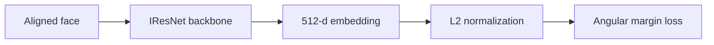
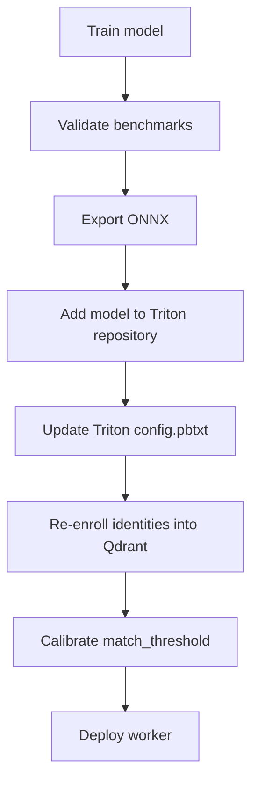

# Training and Model Research

This page summarizes the model research direction and how it connects to production deployment.

## Recognition Model Objective

The embedding model must map face images into a 512-dimensional space where:

- images of the same person are close together;
- images of different people are far apart;
- cosine similarity can be used for identity search.

## ArcFace Baseline

ArcFace uses additive angular margin loss. It improves class separation by applying a margin in angular space, which is well suited for face recognition because embeddings are normalized onto a hypersphere.

```mermaid
flowchart LR
    Face[Aligned face] --> Backbone[IResNet backbone]
    Backbone --> Embedding[512-d embedding]
    Embedding --> Normalize[L2 normalization]
    Normalize --> ArcFace[Angular margin loss]
```

## CDML Research

Combined Dynamic Margin Loss (CDML) extends the ArcFace idea by adjusting the margin according to sample difficulty. The goal is to improve hard-sample discrimination while preserving compact same-identity clusters.

Research findings are summarized in:

- [Results](results.md)
- [ArcFace Research Notes](arcface-research.md)

## Lightweight Backbones

The research branch evaluates IResNet-Lite variants:

| Backbone | Target |
| --- | --- |
| `r18_lite` | Lowest latency |
| `r50_lite` | Balanced latency and accuracy |
| `r100_lite` | Higher accuracy with still smaller size than full R100 |

## Dataset Strategy

| Dataset | Purpose |
| --- | --- |
| CASIA-WebFace | Controlled training and loss comparison |
| MS1MV3 | Large-scale training for better generalization |
| VN-Celeb | Domain-specific threshold and error analysis |
| LFW / CFP-FP / CFP-FF / CALFW / CPLFW / AgeDB | Verification benchmark suites |
| IJB-B / IJB-C | Challenging verification benchmarks |

## Production Export Path

```mermaid
flowchart TD
    A[Train model] --> B[Validate benchmarks]
    B --> C[Export ONNX]
    C --> D[Add model to Triton repository]
    D --> E[Update Triton config.pbtxt]
    E --> F[Re-enroll identities into Qdrant]
    F --> G[Calibrate match_threshold]
    G --> H[Deploy worker]
```

## Deployment Recommendation

For production changes to the recognition backbone:

1. Keep the current model as a baseline.
2. Export the candidate model to ONNX.
3. Add it under a new Triton model name or version.
4. Create a separate Qdrant collection for calibration.
5. Re-enroll the identity dataset.
6. Compare false accepts, false rejects, latency, and stability.
7. Promote the candidate only after threshold calibration.
