# Model Training and Methodology

[← Back to Main README](../README.md)

## Table of Contents

- [Overview](#overview)
- [Training Approach](#training-approach)
- [Combined Dynamic Margin Loss (CDML)](#combined-dynamic-margin-loss-cdml)
- [Network Architectures](#network-architectures)
- [Training Datasets](#training-datasets)
- [Training Configuration](#training-configuration)
- [Model Variants](#model-variants)

## Overview

This project employs **embedding learning** for face recognition, where faces are mapped to a high-dimensional embedding space. The core innovation is the **Combined Dynamic Margin Loss (CDML)**, an extension of ArcFace that applies dynamic margins based on sample difficulty for improved discrimination between classes.

## Training Approach

### Embedding Learning

The system uses metric learning to learn discriminative face representations:

```mermaid
flowchart LR
    A[Input Face<br/>112×112×3] --> B[Backbone Network<br/>IResNet/IResNet_Lite]
    B --> C[Feature Vector<br/>512-dim]
    C --> D[L2 Normalization]
    D --> E[Normalized Embedding<br/>||f|| = 1]
    E --> F[Classification Layer]
    F --> G[Loss Computation<br/>CDML/ArcFace]
    G --> H[Backpropagation]
    H --> B
    
    style A fill:#e1f5ff
    style E fill:#d4edda
    style G fill:#fff3cd
```

**Key Principles:**

1. **Intra-class Compactness:** Embeddings from the same person should be close together
2. **Inter-class Separability:** Embeddings from different people should be far apart
3. **Normalized Space:** All embeddings lie on a hypersphere (||f|| = 1)

### Why CDML?

Traditional softmax loss doesn't enforce sufficient margin between classes. Margin-based losses (SphereFace, CosFace, ArcFace) improve separability by adding fixed margins. **CDML extends this with dynamic margins** that adapt based on:

- **Sample difficulty:** Hard samples get smaller margins, easy samples get larger margins
- **Training progress:** Margins adjust during training
- **Class characteristics:** Different classes can have different margin requirements

## Combined Dynamic Margin Loss (CDML)

### Mathematical Formulation

Building upon ArcFace, CDML modifies the angular margin based on sample difficulty:

**ArcFace Loss:**
```
L = -log(e^(s·cos(θ_yi + m)) / (e^(s·cos(θ_yi + m)) + Σ e^(s·cos(θ_j))))
```

**CDML Enhancement:**
```
m_i = m_base · (1 + α · difficulty(x_i))

where:
- m_base: base margin (e.g., 0.49)
- α: scaling factor for dynamic adjustment
- difficulty(x_i): difficulty score for sample i
```

### Dynamic Margin Strategy

```mermaid
graph TD
    A[Input Sample] --> B[Compute Similarity<br/>to Class Center]
    B --> C{Similarity High?}
    C -->|Yes<br/>Easy Sample| D[Larger Margin<br/>m × 1.2]
    C -->|No<br/>Hard Sample| E[Smaller Margin<br/>m × 0.8]
    D --> F[Apply Loss]
    E --> F
    F --> G[Gradients]
    
    style C fill:#fff3cd
    style D fill:#d4edda
    style E fill:#f8d7da
```



### Advantages of CDML

✅ **Better Generalization**
- Adapts to sample difficulty during training
- Prevents overfitting on easy samples
- Provides stronger signals for hard samples

✅ **Improved Discrimination**
- Larger margins between classes
- Better handling of challenging cases (pose variation, aging, occlusion)

✅ **Training Stability**
- Progressive margin adjustment
- Smooth convergence

## Network Architectures

### IResNet (Improved ResNet)

Standard architecture used as baseline:

| Model | Layers | Parameters | Size (MB) | GFLOPs |
|-------|--------|-----------|-----------|--------|
| R18 | 18 | 24.0M | 91.65 | 2.63 |
| R34 | 34 | 34.1M | 130.20 | 4.48 |
| R50 | 50 | 43.6M | 166.28 | 6.33 |
| R100 | 100 | 65.2M | 248.55 | 12.13 |

### IResNet_Lite (Optimized for Efficiency)

Lightweight variants optimized for resource-constrained deployment:

| Model | Parameters | Size (MB) | Inference (ms) | GFLOPs | Reduction |
|-------|-----------|-----------|----------------|--------|-----------|
| **R18_lite** | **9.2M** | **35.70** | **16.82** | **0.67** | **-62%** |
| R34_lite | 11.8M | 44.84 | 26.20 | 1.13 | -65% |
| R50_lite | 14.1M | 53.87 | 39.39 | 1.60 | -68% |
| R100_lite | 19.5M | 74.47 | 79.10 | 3.05 | **-70%** |

**Optimization Techniques:**

1. **Channel Reduction:** Reduce intermediate channels in residual blocks
2. **Depthwise Separable Convolutions:** Replace standard convolutions where possible
3. **Efficient Downsampling:** Optimize stride operations
4. **Bottleneck Refinement:** Streamline bottleneck architecture

### Architecture Comparison

```mermaid
graph TB
    subgraph Standard["Standard IResNet"]
        A1[Input 112×112×3] --> B1[Conv1: 64 channels]
        B1 --> C1[Stage 1: 64 channels]
        C1 --> D1[Stage 2: 128 channels]
        D1 --> E1[Stage 3: 256 channels]
        E1 --> F1[Stage 4: 512 channels]
        F1 --> G1[FC: 512-dim]
    end
    
    subgraph Lite["IResNet_Lite"]
        A2[Input 112×112×3] --> B2[Conv1: 32 channels]
        B2 --> C2[Stage 1: 32 channels]
        C2 --> D2[Stage 2: 64 channels]
        D2 --> E2[Stage 3: 128 channels]
        E2 --> F2[Stage 4: 256 channels]
        F2 --> G2[FC: 512-dim]
    end
    
    style Standard fill:#fff3cd
    style Lite fill:#d4edda
```



## Training Datasets

### CASIA-WebFace

**Initial Training Dataset**

- **Identities:** 10,575
- **Images:** ~500,000
- **Purpose:** Initial model development and loss function comparison
- **Characteristics:** Moderate size, good for quick experiments

### MS1MV3 (MS-Celeb-1M Refined)

**Large-Scale Training Dataset**

- **Identities:** ~93,000
- **Images:** ~5.2 million
- **Purpose:** Final model training for high accuracy
- **Characteristics:** Large-scale, diverse, cleaned annotations

**Training Strategy:**


### Validation Datasets

Models are evaluated on standard benchmarks:

| Dataset | Pairs | Characteristics |
|---------|-------|-----------------|
| **LFW** | 6,000 | Standard benchmark, frontal faces |
| **CFP-FP** | 7,000 | Profile vs. frontal pose variation |
| **CFP-FF** | 7,000 | Frontal vs. frontal |
| **AgeDB-30** | 12,000 | Age variation (≥30 years) |
| **CALFW** | 6,000 | Age variation in the wild |
| **CPLFW** | 6,000 | Cross-pose in the wild |
| **IJB-B** | 1,845 identities | Challenging verification |
| **IJB-C** | 3,531 identities | Extended IJB-B |

### Custom Dataset: VN-Celeb

**Project-Specific Evaluation**

- **Identities:** 1,131
- **Images:** >18,000
- **Purpose:** Evaluate system on Vietnamese faces
- **Collection:** Celebrity images from public sources

## Training Configuration

### Hyperparameters

**CASIA-WebFace Training:**

```yaml
# Data
batch_size: 128
input_size: 112×112
num_classes: 10,575

# Optimizer
optimizer: SGD
learning_rate: 0.1
momentum: 0.9
weight_decay: 5e-4

# Schedule
epochs: 40
lr_milestones: [15, 25, 35]
lr_gamma: 0.1

# Loss
loss_function: CDML
margin: 0.49
scale: 64
```

**MS1MV3 Training:**

```yaml
# Data
batch_size: 256  # or 512 with multiple GPUs
input_size: 112×112
num_classes: ~93,000

# Optimizer
optimizer: SGD
learning_rate: 0.1
momentum: 0.9
weight_decay: 5e-4

# Schedule
epochs: 25
lr_milestones: [10, 18, 22]
lr_gamma: 0.1

# Loss
loss_function: CDML
margin: 0.49
scale: 64
```

### Data Augmentation

Applied during training:

- Random horizontal flip
- Random cropping
- Color jittering (brightness, contrast, saturation)
- Random rotation (±10°)
- Normalization (mean=[0.5, 0.5, 0.5], std=[0.5, 0.5, 0.5])

### Training Infrastructure

- **Hardware:** NVIDIA GPU (V100/A100 recommended)
- **Framework:** PyTorch 1.8+
- **Distributed Training:** Multi-GPU with DataParallel or DistributedDataParallel
- **Mixed Precision:** FP16 training for faster convergence

## Model Variants

### Available Pre-trained Models

| Model | Dataset | Loss | Accuracy (LFW) | Download |
|-------|---------|------|----------------|----------|
| r18_lite | CASIA | ArcFace | 99.08% | [Link](https://husteduvn-my.sharepoint.com/:f:/g/personal/ky_dn215410_sis_hust_edu_vn/Etlu7CZEWr5Ao1owHA9pOk0B-wwess_BZfVLEbZTcaWSvw?e=gVMQTf) |
| r18_lite | CASIA | CDML | 98.92% | [Link](https://husteduvn-my.sharepoint.com/:f:/g/personal/ky_dn215410_sis_hust_edu_vn/Etlu7CZEWr5Ao1owHA9pOk0B-wwess_BZfVLEbZTcaWSvw?e=gVMQTf) |
| r50_lite | CASIA | CDML | 99.17% | [Link](https://husteduvn-my.sharepoint.com/:f:/g/personal/ky_dn215410_sis_hust_edu_vn/Etlu7CZEWr5Ao1owHA9pOk0B-wwess_BZfVLEbZTcaWSvw?e=gVMQTf) |
| r50_lite | MS1MV3 | CDML | 99.47% | [Link](https://husteduvn-my.sharepoint.com/:f:/g/personal/ky_dn215410_sis_hust_edu_vn/Etlu7CZEWr5Ao1owHA9pOk0B-wwess_BZfVLEbZTcaWSvw?e=gVMQTf) |
| r100_lite | MS1MV3 | CDML | 99.67% | [Link](https://husteduvn-my.sharepoint.com/:f:/g/personal/ky_dn215410_sis_hust_edu_vn/Etlu7CZEWr5Ao1owHA9pOk0B-wwess_BZfVLEbZTcaWSvw?e=gVMQTf) |
| R100 | MS1MV3 | CDML | **99.85%** | [Link](https://husteduvn-my.sharepoint.com/:f:/g/personal/ky_dn215410_sis_hust_edu_vn/Etlu7CZEWr5Ao1owHA9pOk0B-wwess_BZfVLEbZTcaWSvw?e=gVMQTf) |

### Selection Guide

**For Production Deployment (Real-time, CPU):**
- ✅ **r50_lite** - Best balance of accuracy and speed
- ✅ **r18_lite** - Maximum speed, acceptable accuracy

**For High-Accuracy Applications:**
- ✅ **r100_lite** - High accuracy, moderate speed
- ✅ **R100** - Maximum accuracy, GPU recommended

**For Research/Benchmarking:**
- ✅ **R100 + CDML** - State-of-the-art results

---

[📊 View Results →](results.md)

[← Architecture](architecture.md) | [Results →](results.md)

[← Back to Main README](../README.md)
