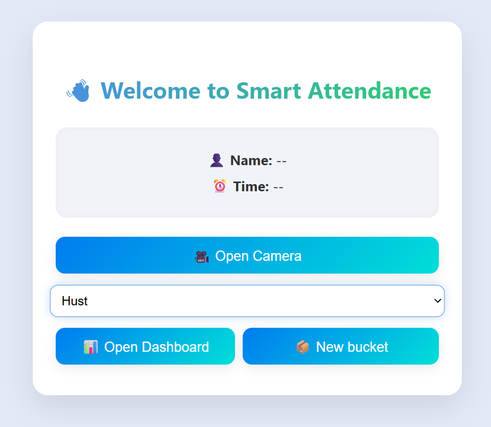
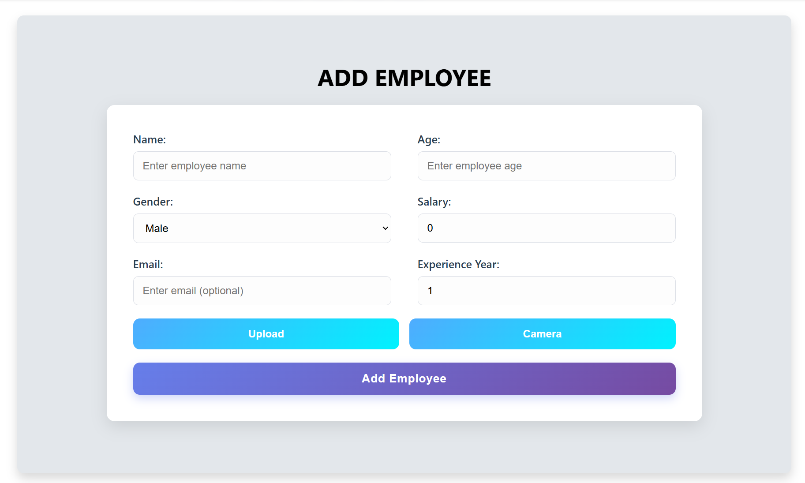
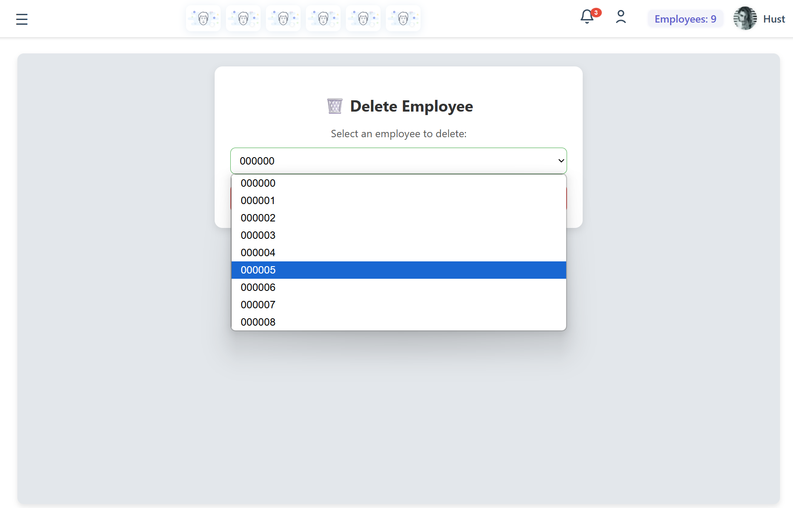
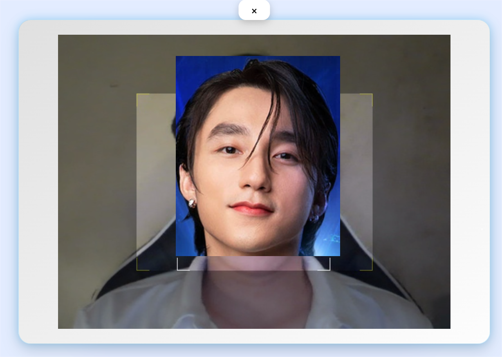
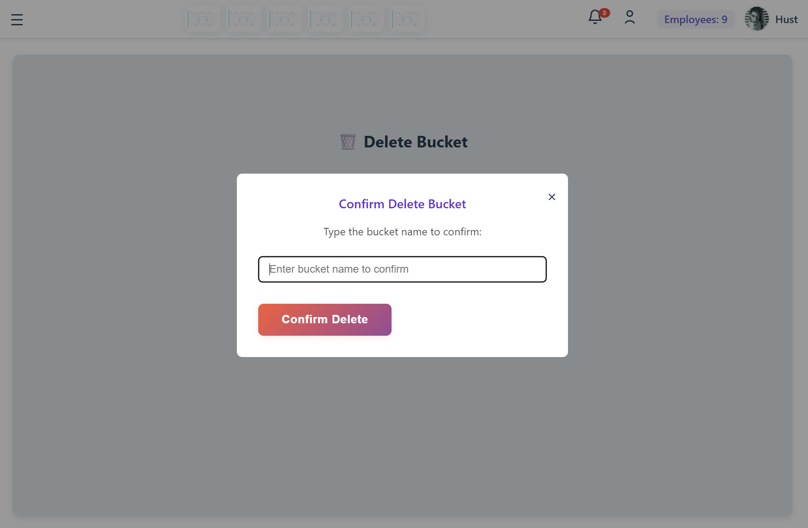
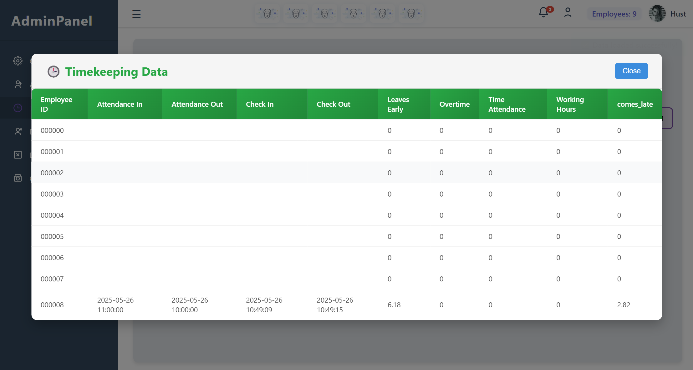

# Usage Guide

[← Back to Main README](../README.md)

## Table of Contents

- [Getting Started](#getting-started)
- [User Interface Overview](#user-interface-overview)
- [Employee Management](#employee-management)
- [Attendance System](#attendance-system)
- [Configuration Management](#configuration-management)
- [Data Export](#data-export)
- [API Usage](#api-usage)

## Getting Started

### Launch the Application

```bash
# Activate virtual environment
source venv/bin/activate  # or: conda activate face-recognition

# Run the main application
python main.py

# Access web interface (if available)
# Navigate to: http://localhost:5000
```

### First-Time Setup

1. **Configure Firebase and Cloudinary** (see [Installation Guide](installation.md))
2. **Create a company/bucket** for your organization
3. **Add employees** and collect face samples
4. **Configure system parameters** in the dashboard
5. **Start attendance system**

## User Interface Overview

The system provides a graphical interface for managing attendance and employee data.

### Main Screen



The main screen provides:
- **Start Attendance Button** - Launch the attendance camera
- **Dashboard Access** - Manage system configuration
- **Employee Management** - Add/remove employees
- **Reports** - View attendance records

### System Workflow


## Employee Management

### Adding New Employees



**Steps:**

1. **Navigate to "Add Employee"**
2. **Enter employee information:**
   - Full name
   - Employee ID
   - Department
   - Email (optional)
   - Phone (optional)

3. **Capture face photos:**


**Best Practices for Photo Capture:**

✅ Ensure good lighting (avoid backlighting)  
✅ Face the camera directly  
✅ Remove glasses or hats (if possible)  
✅ Maintain neutral expression  
✅ Capture 5-10 photos from slightly different angles  
✅ Keep face centered in the frame

**Quality Requirements:**

The system automatically checks:
- ✓ Face size (minimum area)
- ✓ Face position (centered)
- ✓ Lighting quality
- ✓ Sharpness/blur level
- ✓ Pose angle

### Deleting Employees



**Steps:**

1. Navigate to "Employee Management"
2. Select employee from list
3. Click "Delete" button
4. Confirm deletion

> ⚠️ **Warning:** Deleting an employee removes all their data including photos and attendance history.

## Attendance System

### Starting Attendance



**Steps:**

1. Click **"Start Attendance"** on main screen
2. Camera activates automatically
3. Position face within the detection area
4. System processes face through pipeline
5. Shows identification result
6. Records attendance to database

### Attendance Process Flow


### Real-time Feedback

During attendance, the system displays:

- **Green box** - Face detected and validated
- **Red box** - Face detected but quality issues
- **Yellow box** - Anti-spoofing check in progress
- **Center guide** - Position indicator for optimal face placement

**Status Messages:**

| Message | Meaning |
|---------|---------|
| "Position your face" | Face not centered |
| "Too far" | Move closer to camera |
| "Low quality" | Improve lighting or focus |
| "Checking..." | Processing in progress |
| "Welcome, [Name]!" | Successful recognition |
| "Unknown person" | Face not in database |
| "Spoof detected" | Presentation attack detected |

## Configuration Management

### Dashboard


The dashboard provides centralized control over system parameters.

### Configurable Parameters

#### Pipeline Settings

```yaml
# Adjust these in the dashboard or config.yaml

detection_model: "blazeface"  # or "mtcnn"
quality_threshold: 0.5        # 0.0 - 1.0
anti_spoofing_enabled: true
embedding_model: "r50_lite"   # r18_lite, r50_lite, r100_lite
```

#### Recognition Settings

```yaml
similarity_metric: "cosine"   # or "euclidean"
threshold: 0.705              # Lower = stricter
min_validation_frames: 3      # Frames required for confirmation
```

#### Camera Settings

```yaml
camera_device: 0              # Camera index
resolution: [1280, 720]       # Width, height
fps: 30                       # Frames per second
```

### Threshold Adjustment Guide

| Use Case | Recommended Threshold | Trade-off |
|----------|----------------------|-----------|
| **High Security** | 0.60 - 0.65 | More false rejects, fewer false accepts |
| **Balanced** ✅ | 0.70 - 0.75 | Optimal balance |
| **Convenience** | 0.80 - 0.85 | Fewer false rejects, more false accepts |

### Bucket (Company) Management

#### Creating New Bucket


**Steps:**
1. Click "Add Bucket"
2. Enter company/organization name
3. Configure company-specific settings
4. Save

#### Deleting Bucket



> ⚠️ **Warning:** Deleting a bucket removes all associated employees and attendance data.

## Data Export

### Viewing Attendance Records


View attendance records with:
- Employee name and photo
- Check-in time
- Check-out time
- Date
- Status

### Detailed Attendance Information



Access detailed information including:
- Attendance snapshots
- Face recognition confidence scores
- Entry/exit logs
- Irregular patterns

### Exporting Data

**Export to CSV:**

```python
# Using the export utility
python scripts/export_attendance.py --start-date 2026-01-01 --end-date 2026-01-31 --output attendance.csv
```

**Export to Excel:**

```python
python scripts/export_attendance.py --start-date 2026-01-01 --end-date 2026-01-31 --format xlsx --output attendance.xlsx
```

**Export Format:**

| Employee ID | Name | Date | Check-in | Check-out | Hours |
|-------------|------|------|----------|-----------|-------|
| EMP001 | John Doe | 2026-01-15 | 08:30:15 | 17:45:22 | 9.25 |

## API Usage

### Python API

#### Enrollment

```python
from system.enrollment import EnrollmentManager

# Initialize manager
manager = EnrollmentManager(config_path='config.yaml')

# Enroll new employee
employee_id = manager.enroll_employee(
    name="John Doe",
    employee_id="EMP001",
    images=["path/to/photo1.jpg", "path/to/photo2.jpg"],
    department="Engineering"
)

print(f"Enrolled employee: {employee_id}")
```

#### Recognition

```python
from system.recognition import RecognitionSystem

# Initialize system
system = RecognitionSystem(config_path='config.yaml')

# Recognize from image
result = system.recognize_from_image("path/to/query.jpg")

if result['match']:
    print(f"Identified: {result['name']}")
    print(f"Confidence: {result['similarity']:.3f}")
else:
    print("Unknown person")
```

#### Real-time Attendance

```python
from system.attendance import AttendanceSystem

# Initialize attendance system
attendance = AttendanceSystem(config_path='config.yaml')

# Start real-time attendance
attendance.start_camera_attendance(
    camera_id=0,
    on_recognition=lambda result: print(f"Attendance: {result}")
)
```

### REST API (Optional)

If running the web server:

#### Check System Status

```bash
curl http://localhost:5000/api/status
```

#### Record Attendance

```bash
curl -X POST http://localhost:5000/api/attendance \
  -H "Content-Type: application/json" \
  -d '{"employee_id": "EMP001"}'
```

#### Get Attendance Records

```bash
curl "http://localhost:5000/api/attendance?start_date=2026-01-01&end_date=2026-01-31"
```

## Advanced Usage

### Batch Processing

Process multiple images:

```python
from system.batch import BatchProcessor

processor = BatchProcessor(config_path='config.yaml')
results = processor.process_directory("path/to/images/")

for result in results:
    print(f"{result['filename']}: {result['identity']}")
```

### Custom Pipeline

Build a custom recognition pipeline:

```python
from models.Detection.mtcnn import MTCNN
from models.Recognition.Arcface_torch import get_model
from system.matcher import EmbeddingMatcher

# Initialize components
detector = MTCNN()
recognizer = get_model('r50_lite')
matcher = EmbeddingMatcher()

# Process image
faces = detector.detect(image)
embeddings = recognizer(faces)
matches = matcher.match(embeddings)
```

---

[🔮 View Future Work →](future-work.md)

[← Installation](installation.md) | [Future Work →](future-work.md)

[← Back to Main README](../README.md)
