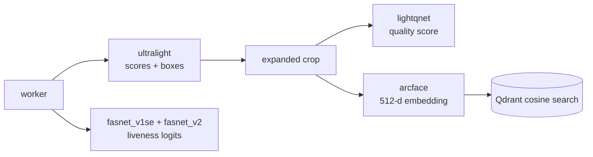

# Triton Model Repository

This directory is mounted into the Triton container at `/models`.

```yaml
triton:
  image: nvcr.io/nvidia/tritonserver:24.12-py3
  command: tritonserver --model-repository=/models --strict-model-config=true
```

## Runtime Layout

```text
triton_model_repository/
  ultralight/
    config.pbtxt
    1/version-RFB-640-dynamic.onnx
  arcface/
    config.pbtxt
    1/backbone_r18.onnx
  lightqnet/
    config.pbtxt
    1/lightqnet-dm100.onnx
  fasnet_v1se/
    config.pbtxt
    1/4_0_0_80x80_MiniFASNetV1SE.onnx
  fasnet_v2/
    config.pbtxt
    1/2.7_80x80_MiniFASNetV2.onnx
```

## Model Contract

| Triton model | File | Input | Output | Pipeline stage |
| --- | --- | --- | --- | --- |
| `ultralight` | `version-RFB-640-dynamic.onnx` | `input`: FP32 `[B, 3, 480, 640]` | `scores`: `[B, 17640, 2]`, `boxes`: `[B, 17640, 4]` | Face detection |
| `lightqnet` | `lightqnet-dm100.onnx` | `input:0`: FP32 `[B, 96, 96, 3]` | `confidence_st:0`: `[B, 1]` | Face quality |
| `arcface` | `backbone_r18.onnx` | `input`: FP32 `[B, 3, 112, 112]` | `embedding`: `[B, 512]` | Face embedding |
| `fasnet_v1se` | `4_0_0_80x80_MiniFASNetV1SE.onnx` | `input`: FP32 `[B, 3, 80, 80]` | `logits`: `[B, 3]` | Liveness |
| `fasnet_v2` | `2.7_80x80_MiniFASNetV2.onnx` | `input`: FP32 `[B, 3, 80, 80]` | `logits`: `[B, 3]` | Liveness |

## Detector Configuration

The current pipeline uses UltraLight RFB 640:

```yaml
detection:
  input_width: 640
  input_height: 480
triton:
  detector_model: ultralight
```

`ultralight/config.pbtxt` must match:

```text
default_model_filename: "version-RFB-640-dynamic.onnx"
dims: [3, 480, 640]
```

If you switch back to a 320 model, update all of these together:

- `triton_model_repository/ultralight/config.pbtxt`
- `config.yaml` `detection.input_width` and `detection.input_height`
- the ONNX file under `triton_model_repository/ultralight/1/`

## Export Dynamic Batch UltraLight

Example for RFB 640:

```bash
python -m models.UltraLight.export_dynamic_onnx \
  --input models/UltraLight/weights/version-RFB-640.onnx \
  --output triton_model_repository/ultralight/1/version-RFB-640-dynamic.onnx \
  --input-width 640 \
  --input-height 480 \
  --verify-batch 2
```

## Triton Checks

Start Triton:

```bash
docker compose up -d triton
```

Health:

```bash
curl http://localhost:8000/v2/health/ready
```

Model metadata:

```bash
curl http://localhost:8000/v2/models/ultralight
curl http://localhost:8000/v2/models/lightqnet
curl http://localhost:8000/v2/models/arcface
curl http://localhost:8000/v2/models/fasnet_v1se
curl http://localhost:8000/v2/models/fasnet_v2
```

Smoke-test all pipeline stages:

```bash
python -m pipeline.stages.test_stages_io \
  --url localhost:8000 \
  --image FacenetDataset/employee_a/001.jpg
```

## Triton Call Graph



## Notes

- `--strict-model-config=true` means `config.pbtxt` must match the ONNX model exactly.
- The most common detector error is an input shape mismatch between ONNX, `config.pbtxt`, and `config.yaml`.
- Do not commit model weights if the repository is public or the weights have restricted licensing.
